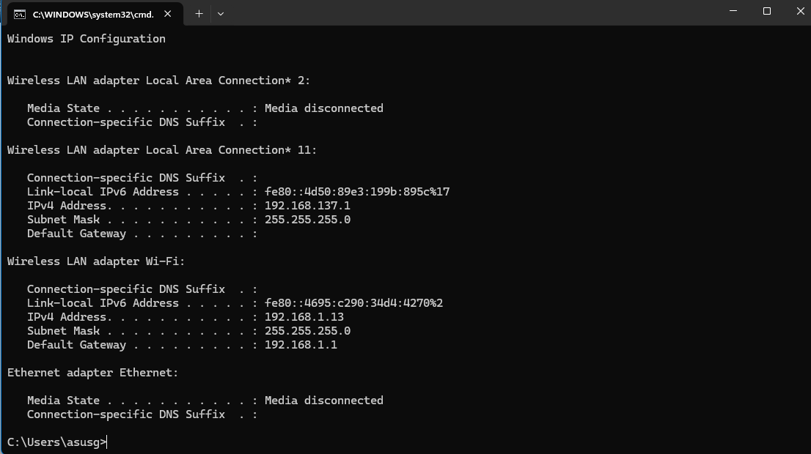
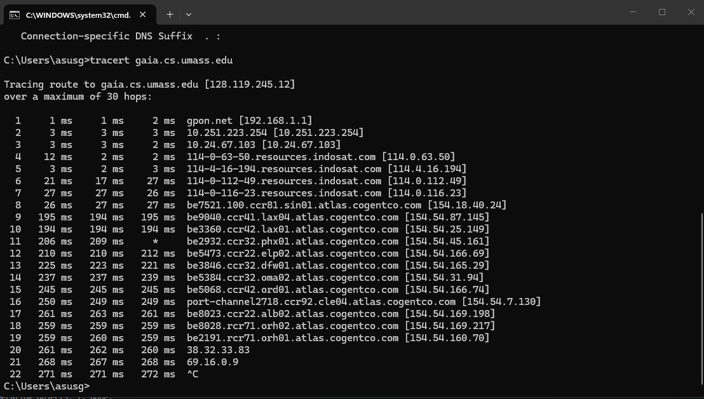
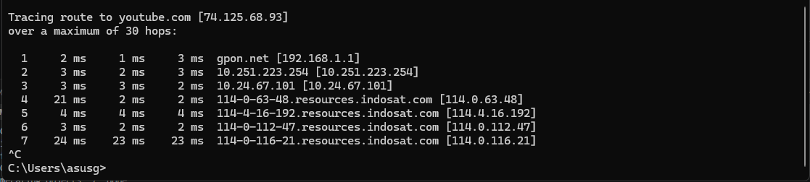

# Laporan Jaringan Komputer Informatika Week 10

# A. Apa itu IP Address

IP address itu merupakan alamat unik yang digunakan oleh setiap device untuk dapat saling terhubung dalam suatu jaringan sehingga mereka dapat saling berkomunikasi satu sama lain. berikut contoh dibawah ini merupakan contoh implementasi untuk melakukan pengecekan IP melalui terminal menggunakan syntax "ipconfig". terlihat seperti dibawah ini ip saat ini sedang mendapatkan langsung dari akses point atau DHCP langsung dari ONT. "192.168.1.13".

    

# B. Traceroute dari suatu website

Selanjutnya adalah mencoba untuk traceroute suatu website. disini sebagai salah satu contoh yang dimuat adalah website dari gaia.cs.umass.edu. traceroute sendiri itu merupakan  melacak jalur atau rute paket data dari komputer ke tujuan. dengan menunjukan setiap hop yang dilewati. seperti pada gambar dibawah ini titik yang terhubung adalah dari resources.indosat selain itu juga ada atlas.cogentco. agar lebih faham mengenai route beberapa implementasi website yang bisa dipaparkan seperti dibawah ini. dan satu lagi traceroute juga dapat digunakan untuk mengukur waktu respons di setiap titiknya.

    
    

# C. apa itu ICMP, MTU, dan TTL

Selanjutnya adalah selain mempelajari IP terdapat beberapa istilah lainnya seperti ICMP yang merupakan protokol lapisan jaringan yang digunakan oleh perangkat jaringan untuk mengirim pesan kesalahan. contoh yang biasa diterapkan biasanya adalah ping atau seperti sebelumnya yaitu traceroute.

 --- 

lalu ada MTU atau kepanjangannya adalah maximum transmission unit. dimana ini merupaka ukuran terbesar dari frame atau paket data yang dapat dikirimkan melalui koneksi jaringan. biasanya fungsinya adalah mengatur ukuran paket agar sesuai dengan kapasitas perangkat keras yang dimiliki.

 --- 

 Dan terakhir ada Time to Live ini merupakan paket data yang menentukan berapa lama atau berapa banyak hop paket itu diizinkan di jaringan. biasanya ini digunakan untuk mencegah paket data berputar tanpa akhir di jaringan jika terjadi kesalahan rute.

# D. Mencari Contoh Fragmentasi di Wireshark

# E. Mencari IPv6 di Wireshark
