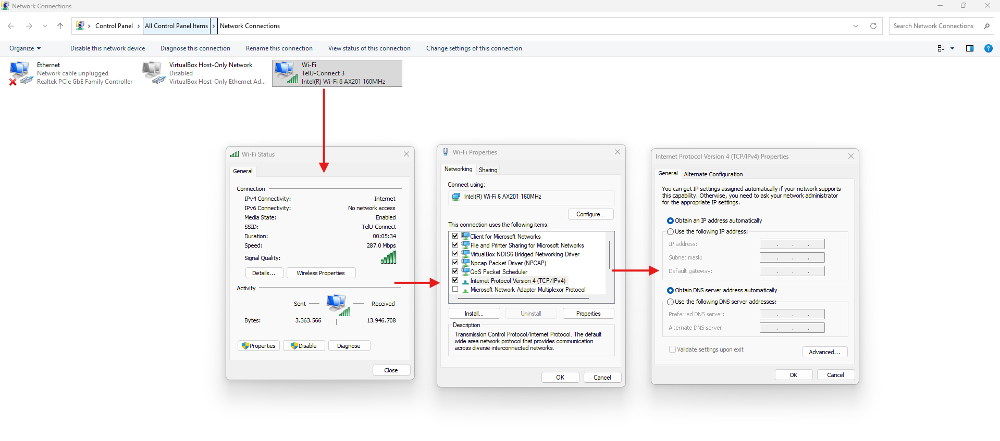
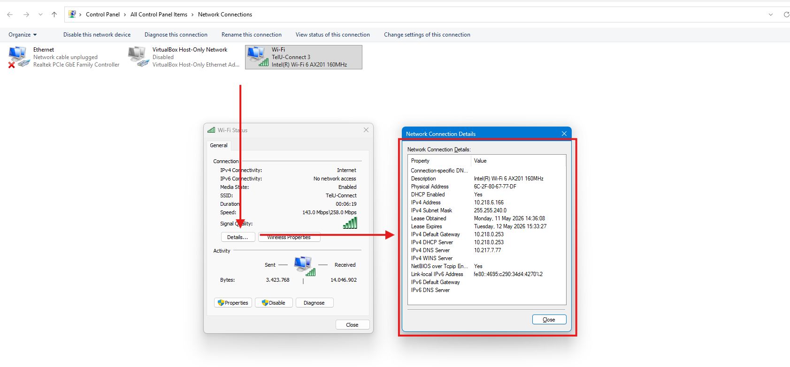
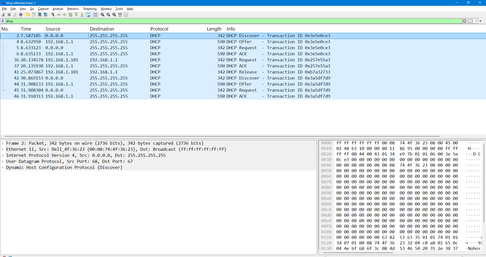

# Laporan Jaringan Komputer Informatika Week 11

# A. Apa itu DHCP ?

Sebelum mengetahui apa itu DHCP mungkin terlebih dahulu harus mengetahui kepanjangannya, DHCP sendiri itu adalah Dynamic Host Configuration Protocol. ini biasa digunakan oleh banyak jaringan LAN dimana ia memberikan IP secara otomatis oleh router atau penyedia DHCP sehingga meminimalisirkan terjadinya tabrakan IP antar clientnya. berikut dibawah ini contoh untuk melihat IP yang diberikan oleh router dijaringan LAN adalah masuk pada network connection lalu memilih jaringan yang saat ini terhubung. contoh seperti dibawah gambar ini. ia mendaptkan IP "10.218.6.166" dengan dns servernya yaitu "10.217.7.77".

    
    

# B. Kelebihan dan Kekurangan DHCP ?

 Terdapat beberapa kelebihan dan kekurangan DHCP sendiri yaitu, kelebihannya adalah ia bisa memanajemen IP sehingga client dapat IP mereka masing - masing tanpa harus mengkhatirkan terjadinya tabrakan IP, dapat meningkatkan efisiensi jaringan karena dapat mengatur prefixnya sehingga tidak boros, Otomatisasi Konfigurasi Jaringan jadi setiap client tidak perlu lagi repot - repot untuk memasukkan IP secara manual, dan terakhir adalah pengelolaannya secara terpusat.

 

 ada juga kekurangan yang dimiliki oleh fitur DHCP sendiri ini adalah terkadang penanganannya sangat kompleks jika topologi yang dikerjakan sangat besar, kemudian ketergantungan pada server jika server saat itu sedang down maka client yang menginginkan IP tidak dapat terhubung, dan terakhir adalah alamat IP dapat berubah - ubah / dinamis pada setiap kali reconnect ini sangat tidak cocok apabika berhubungan dengan IoT yang memerlukan IP secara static.

# C. DORA ?

 terakhir masuk pada DORA dimana ini merupakan cara kerja DHCP komunikasi antara client dan server. proses yang pertama adalah client mencari DHCP Server dengan discover atay menyebarkan pesan broadcast. seperti pada contoh implementasi dibawah destinationnya berupa 0.0.0.0 dan broadcastnya adalah 255.255.255.255. kemudian masuk pada Offer yang merupakan sikap dari server untuk menawarkan alamat IP kepada client. kemudian lanjut pada tahap request seorang client meminta atau menyetujui penawaran IP dari server. dan proses terakhirnya adalah ack atau bisa disebut dengan Acknowledgment dimana ini adalah  Server mengirimkan konfirmasi bahwa IP tersebut resmi disewakan ke client. berikut seperti dibawah ini adalah contoh penerapannya dalam wireshark. 

    
