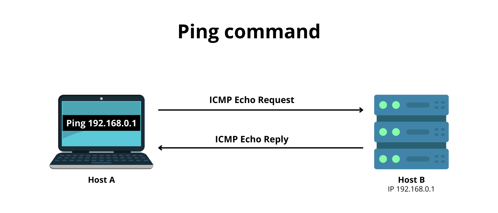
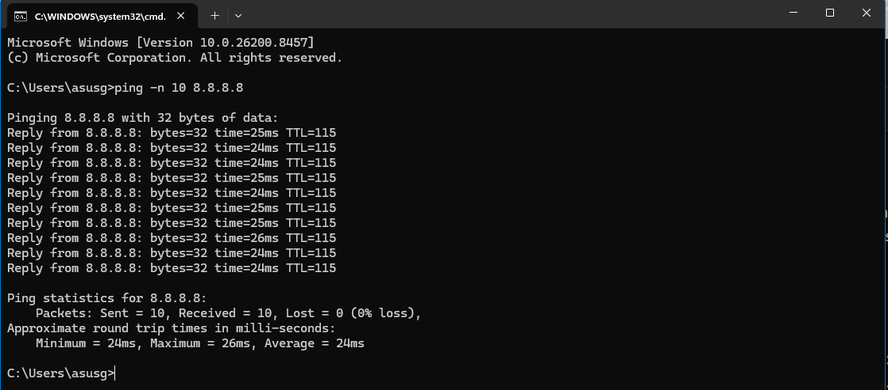
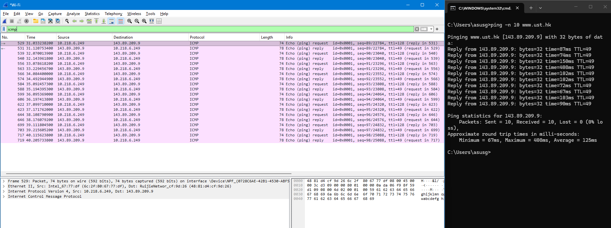
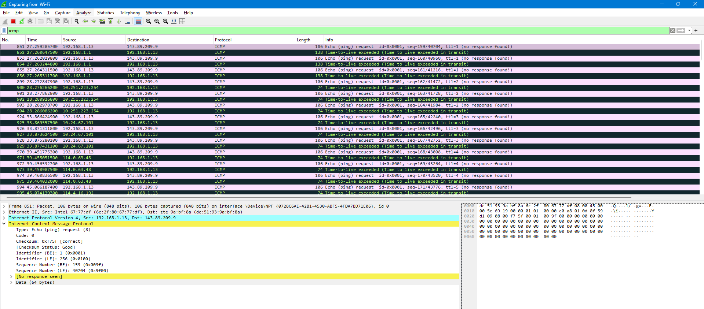

# Laporan Jaringan Komputer Informatika Week 12

 Sebelum melakukan implementasi pada ICMP terlebih dahulu mengetahui apa sebenarnya ICMP itu? jadi icmp itu singkatan dari internet control message protocol dimana ini adalah protokol jaringan yang digunakan perangkat dan router untuk mengirimkan pesan kesalahan dan informasi operasional. Protokol ini bekerja di balik layar agar paket data mencapai tujuan dan mendiagnosis masalah koneksi.

 

1. **Fungsi ICMP**
   - Biasanya untuk mendeteksi masalah pada jaringan.
   - Untuk melakukan pelacakan aktivitas koneksi di setiap titik.
   - Memberikan sinyal jika paket data terlalu lama berada di dalam jaringan sebelum sampai ke tujuan.

2. **Bagaimana cara kerja ICMP**

ICMP merupakan protokol tanpa koneksi karena ia tidak terkait dengan protokol lapisan transport seperti TCP dan UDP. jadi satu perangkat tidak perlu membuka koneksi dengan perangkat lain sebelum mengirim pesan ICMP. Lalu lintas IP normal dikirim menggunakan TCP, yang berarti setiap dua perangkat yang bertukar data pertama akan melakukan hand shake TCP untuk memastikan kedua perangkat siap menerima data. ICMP tidak membuka koneksi dengan cara itu.

# A. Pesan ICMP yang dihasilkan oleh program Ping.

 Langkah pertama untuk mengimplementasikan pesan ICMP yang dihasilkan program ping adalah membuka command terminal windows. kemudian mengetikkan syntax yait ping 8.8.8.8 atau jika ingin melihat hanya beberapa baris berarti syntax yang digunakan harus lebih spesifik. contohnya adalah ping -n 10 8.8.8.8 dimana -n itu adalah merupakan batas maksimal yang dapat dijalankan oleh terminal sedangkan 10 adalah nilai atau jumlah x yang ingin ditentukan seberapa banyak baris untuk ngetrack pesan pingnya. seperti pada contoh gambar dibawah ini terdapat beberapa pesan yang sempurna atau jaringan sedang berjalan dengan normal tanpa terjadi request time out yang berarti beberapa data hilang.

 

Nah untuk ICMP sendiri ia dibagi menjadi dua tugas yaitu ICMP Echo Request tipe 8 yang dimana pesan yang dikirim oleh komputer ke perangkat tujuan untuk mengecek apakah perangkat tersebut aktif dan terhubung. dan yang kedua adalah ICMP Echo Reply tipe 0 dimana ini merupakan pesan balasan yang dikirim balik oleh perangkat tujuan ke komputer, yang menandakan bahwa perangkat itu menerima permintaan.

    
    

 Selanjutnya jika dilihat melalui wireshark maka akan terdapat beberapa track dimana masing - masing track tersebut menerangkan reply dan request jika misal melihat koneksi sebanyak 10 maka total baris yang akan keluar adalah 20 dimana 10 milik request dan 10 lagi milik reply.

    

# B. Pesan ICMP yang dihasilkan oleh program Traceroute.

 Selanjutnya adalah mengimplementasikan tracert menggunakan pengecekan pada CMD dan juga wireshark. Seperti pada gambar dibawah ini dalam proses pengecekan rute jaringan, program traceroute menghasilkan dan menerima dua jenis pesan utama dari protocol ICMP. yaitu Time Exceeded dan Destination Unrecable. dimana Time Exceeded dihasilkan oleh setiap router di sepanjang jalur saat nilai Time to Live pada paket data habis mencapai 0. Router akan mengirimkan pesan ini kembali ke pengirim untuk mengidentifikasi lokasinya. sedangkan Destination Unreachable dihasilkan ketika paket telah mencapai host tujuan akhir, atau jika tujuan tidak dapat dijangkau oleh jaringan. Disini ketika setiap kali paket itu kehabisan TTL di tengah jalan, router yang menanganinya akan membuang paket tersebut dan mengirimkan pesan balasan yaitu ICMP Time-to-live exceeded.

    

# C. format dan isi pesan ICMP.

| Type               | Panjang | Deskripsi                                                                                                                                        |
| ------------------ | ------- | ------------------------------------------------------------------------------------------------------------------------------------------------ |
| Type               | 8 bit   | Menentukan jenis atau kategori utama dari pesan ICMP yang dikirimkan.                                                                            |
| Code               | 8 Bit   | Memberikan informasi atau sub-kategori yang lebih spesifik mengenai Type. kalau Type adalah gambaran umumnya, maka Code adalah alasan detailnya. |
| CheckSum           | 16 bit  | Digunakan untuk mendeteksi apakah terjadi kerusakan paket selama proses transmisi.                                                               |
| Rest of the header | 32 bit  | Bagian header tambahan yang isinya bervariasi tergantung pada nilai Type dan Code yang digunakan.                                                |
| Data Section       | Dynamic | Tempat diletakkannya muatan utama yaitu payload atau informasi tambahan dari pesan ICMP.                                                         |
