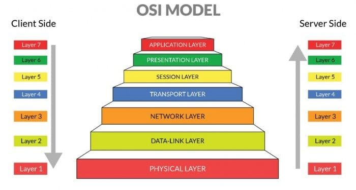

# Laporan Jaringan Komputer Informatika Week 13

Setelah melalui proses minggu sebelumnya yang membahas tentang ICMP selanjutnya masuk pada arp dimana ini merupakan singkatan dari Address Resolution Protocol, arp sendiri merupakan protokol jaringan yang berfungsi memetakan alamat IP menjadi alamat MAC. ARP ini membuat komunikasi antara perangkat dalam jaringan local agar data yang dikirim dengan alamat IP dapat diterjemahkan ke perangkat keras yang benar. untuk melihat gambaran arp ini pada osi layer prosesnya berupa pada saat diterima di layer 3 atau network ia menerima request IP tujuan. dan kemudian di eksekusi di layer 2 yaitu data link  dengan menggunakan MAC address fisik untuk memastikan pengiriman data frame sampai ke perangkat keras yang tepat.

 

1. **Bagaimana cara kerja ARP**

Cara kerja dari Address Resolution Protocol ini adalah Saat sebuah perangkat ingin mengirim data ke perangkat lain dalam jaringan lokal, ia hanya mengetahui alamat IP tujuanya saja, sedangkan pengiriman data di tingkat data link layer ia membutuhkan alamat MAC. maka proses terjadinya ia adalah yang pertama Perangkat pengirim akan memeriksa tabel memori lokalnya untuk melihat apakah alamat MAC tujuan sudah tercatat. kemudian Jika tidak ditemukan, perangkat akan mengirimkan pesan broadcast yang berisikan pertanyaan biasanya kurang lebih seperti ini "Siapa pemilik alamat IP ini?" lalu terakhir  Perangkat yang memiliki alamat IP yang dimaksud akan merespons balik dan memberikan informasi alamat MAC miliknya.

    

2. **Implementasi praktikum ARP**

