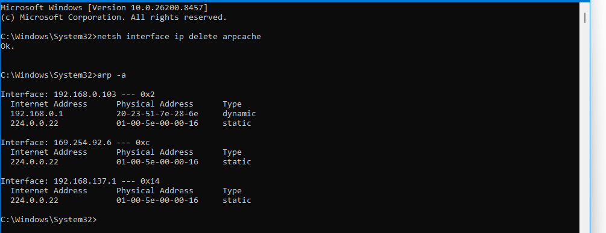
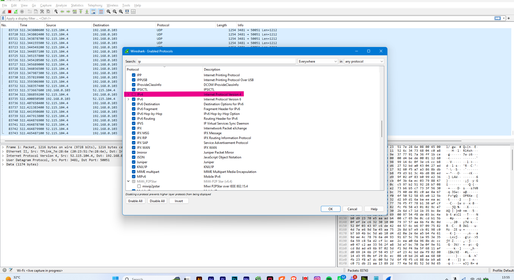
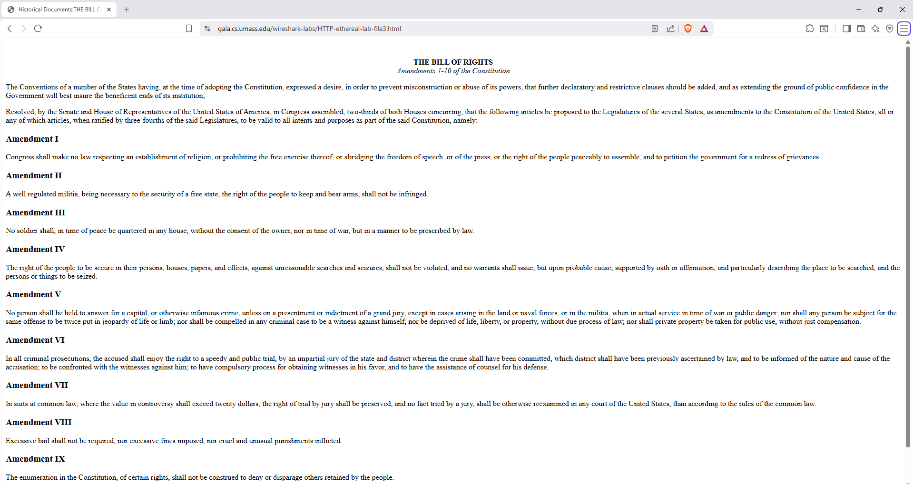
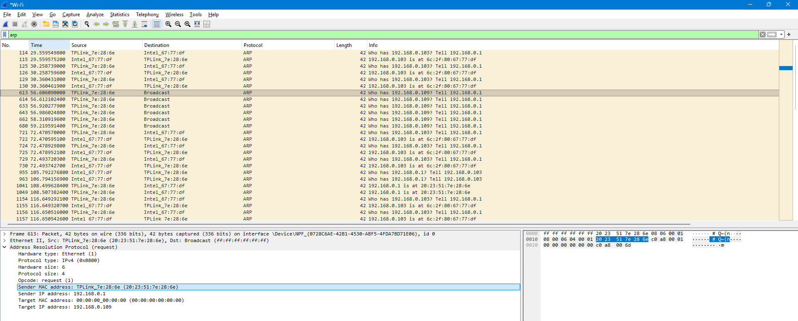
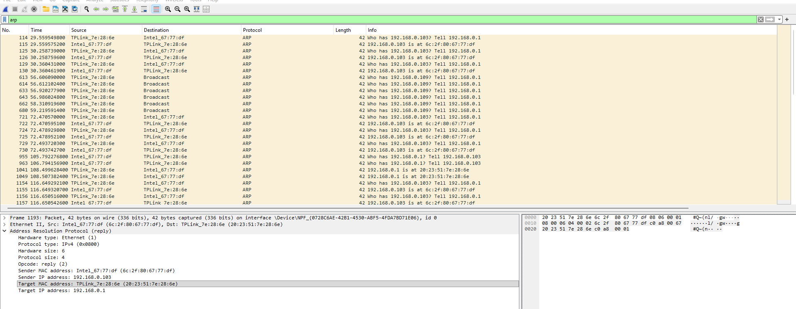

# Laporan Jaringan Komputer Informatika Week 13

Setelah melalui proses minggu sebelumnya yang membahas tentang ICMP selanjutnya masuk pada arp dimana ini merupakan singkatan dari Address Resolution Protocol, arp sendiri merupakan protokol jaringan yang berfungsi memetakan alamat IP menjadi alamat MAC. ARP ini membuat komunikasi antara perangkat dalam jaringan local agar data yang dikirim dengan alamat IP dapat diterjemahkan ke perangkat keras yang benar. untuk melihat gambaran arp ini pada osi layer prosesnya berupa pada saat diterima di layer 3 atau network ia menerima request IP tujuan. dan kemudian di eksekusi di layer 2 yaitu data link  dengan menggunakan MAC address fisik untuk memastikan pengiriman data frame sampai ke perangkat keras yang tepat.

 

1. **Bagaimana cara kerja ARP**

Cara kerja dari Address Resolution Protocol ini adalah Saat sebuah perangkat ingin mengirim data ke perangkat lain dalam jaringan lokal, ia hanya mengetahui alamat IP tujuanya saja, sedangkan pengiriman data di tingkat data link layer ia membutuhkan alamat MAC. maka proses terjadinya ia adalah yang pertama Perangkat pengirim akan memeriksa tabel memori lokalnya untuk melihat apakah alamat MAC tujuan sudah tercatat. kemudian Jika tidak ditemukan, perangkat akan mengirimkan pesan broadcast yang berisikan pertanyaan biasanya kurang lebih seperti ini "Siapa pemilik alamat IP ini?" lalu terakhir  Perangkat yang memiliki alamat IP yang dimaksud akan merespons balik dan memberikan informasi alamat MAC miliknya.

    

2. **Implementasi Praktikum ARP**

1.1 Langkah pertama yang harus dilakukan adalah membuka cmd dengan mode administrator untuk menjalankan syntax arp -d * untuk menghapus semua tabel ARP yang berisikan informasi alamat MAC yang harus digunakan sebagai tujuan fisik pada frame data yang akan dikirim. dikarenakan pada saat implementasi terjadi sebuah masalah maka alternatif yang digunakan saya saat itu adalah dengan syntax netsh interface ip delete arpcache yang memiliki kegunaan yang sama seperti syntax sebelumnya lalu selanjutnya diteruskan dengan menuliskan syntax arp -a untuk  menampilkan seluruh daftar tabel ARP untuk memastikan syntax berjalan dengan baik.

    

1.2 Setelah selesai selanjutnya membuka platform wireshark untuk memulai track di kelas arp. pertama masuk pada jaringan yang terhubung dengan internet saat ini kemudian masuk pada tab analyze lalu klik pada sub menu enable protocols dan meng-uncheck pada pilihan IPv4. setelah selesai selanjutnya simpan hasil settingan tersebut.

    

1.3 Masuk pada tahap pengujian disini membuka situs http://gaia.cs.umass.edu/wireshark-labs/HTTP-ethereal-lab-file3.html sebagai bahan uji coba pada filter arp pada wireshark. dan tentunya tidak lupa untuk menghapus semua cache history ataupun cache lainnya supaya tidak terjadi sebuah trouble saat uji coba dijalankan pada halaman web tersebut.

    

1.4 Kembali pada menu wireshark mengaktifkan filter ARP agar semua informasi pada layer dapat sesuai dengan ketentuan yaitu arp. dengan fitur tersebut ini memudahkan kita untuk mengecek sender dan target MAC address di request dan reply.

    

1.5 ARP request broadcast Ketika suatu perangkat misalnya router dengan IP saat ini 192.168.0.1 ingin mengirim data ke perangkat lain yaitu 192.168.0.109, ia tahu IP tujuannya tapi tidak tahu MAC Address-nya. Karena tidak tahu, ia mengirimkan pesan Broadcast. disini untuk destination Broadcast Dikirim ke semua orang. lalu untuk info adalah pertanyaannya yang berisi Who has 192.168.0.109? Tell 192.168.0.1. kemudian ada Target MAC address yang masih kosong karena masih belum diketahui.

    

1.6 kemudian ARP Reply yang merasa memiliki IP 192.168.0.109 akan membalas pesan itu secara langsung ke router, memberi tahu MAC Address fisiknya. Setelah itu, router akan menyimpannya di tabel ARP cache. disini kegunaan dari ARP adalah untuk mencari tahu MAC address router atau perangkat lain di rumah, jadi ia hanya menerima paket kemudian  router yang akan meneruskannya ke jaringan luar hingga sampai ke tujuan.

    
