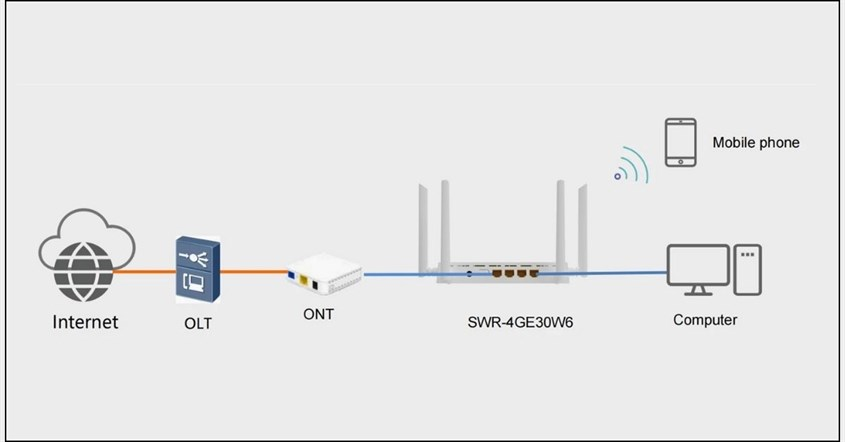
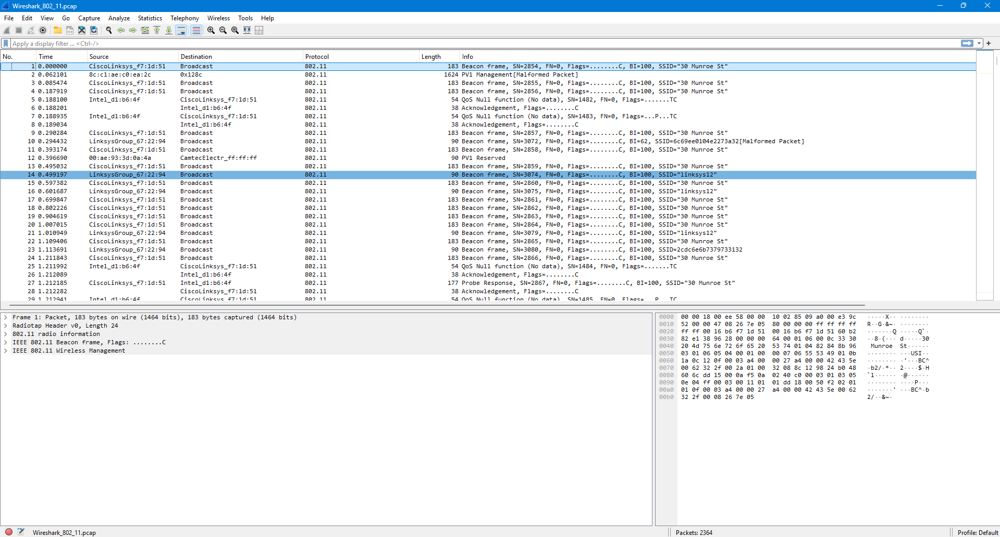
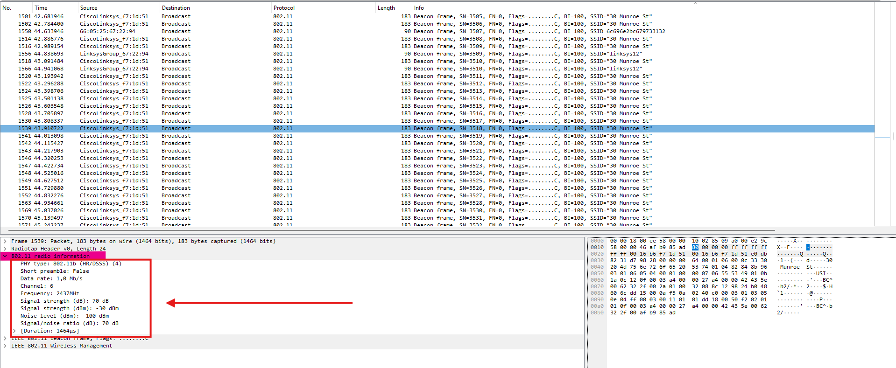
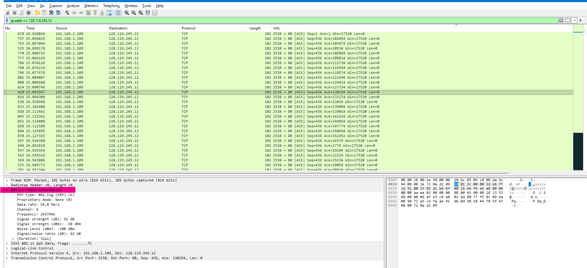
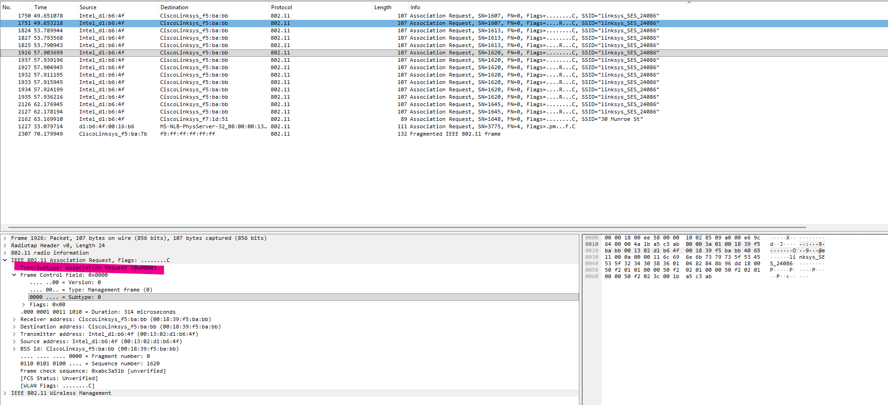
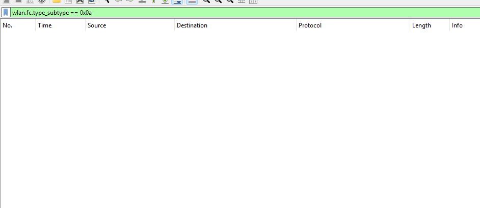

# Laporan Jaringan Komputer Informatika Week 14

Setelah mempelajari tentang apaitu arp dan juga ethernet selanjutnya adalah masuk pada materi tentang wifi 802.11. dimana ini adalah serangkaian standar teknis yang dikembangkan oleh Institute of Electrical and Electronics Engineers atau biasa disebut dengan IEEE untuk mengatur komunikasi jaringan area lokal nirkabel. Sejak pertama kali diperkenalkan pada tahun 1997, standar 802.11 terus mengalami evolusi besar untuk memenuhi kebutuhan internet yang semakin kurang akan kecepatan dan stabilitas. Evolusi ini melahirkan berbagai generasi Wi-Fi yang awalnya dikenal dengan akhiran huruf teknis seperti 802.11b, 802.11g, 802.11n. Setiap generasi baru membawa peningkatan pada kecepatan transfer data, efisiensi spektrum frekuensi memanfaatkan pita 2.4 GHz dan 5 GHz. dan kemampuan untuk menangani puluhan perangkat sekaligus dalam satu jaringan tanpa mengalami lag atau penurunan performa yang drastis.

1. **Bagaimana cara kerja Wi-Fi 802.11**

Selanjutnya masuk tahap bagaimana cara kerja dari Wi-Fi 802.11 yaitu proses dimulai ketika perangkat seperti smartphone atau laptop ingin mengirimkan data misalnya permintaan membuka sebuah situs web. Data digital yang terdiri dari kode biner seperti 0 dan 1 akan terlebih dahulu diproses oleh kartu jaringan nirkabel di dalam perangkat, lalu diubah menjadi sinyal radio frekuensi tinggi. Sinyal ini kemudian dipancarkan lewat antena perangkat menuju ke udara dalam bentuk gelombang elektromagnetik pada pita frekuensi yang umumnya berada di spektrum 2.4 GHz dan 5 GHz. Di sisi penerima, perangkat AP atau router bertugas menangkap gelombang radio itu menggunakan antenanya. Setelah sinyal radio diterima, router akan melakukan proses sebaliknya, yaitu mengonversi kembali gelombang elektromagnetik tersebut menjadi data digital biner yang dapat dipahami oleh sistem komputer. Karena router terhubung secara fisik menggunakan kabel ke jaringan internet global, router akan meneruskan data tersebut ke server tujuan di internet untuk diproses, dan nantinya mengirimkan kembali responnya ke perangkat melalui jalur udara yang sama.

    

2. **Implementasi Praktikum**

Langkah pertama yang harus dilakukan adalah membuka wireshark kemudian memilih file Wireshark_802_11.pcap yang sudah disediakan oleh buku modul maka implementasi seperti dibawah ini akan muncul.

    

Pada tahap ini, langkah selanjutnya adalah menganalisis Beacon Frame yang dikirimkan oleh Access Point (AP) melalui jendela detail protokol IEEE 802.11 di Wireshark guna mengidentifikasi parameter jaringan seperti SSID, Beacon Interval, dan kapabilitas keamanan. jadi yang didapat adalah Paket ini ditransmisikan menggunakan standar 802.11b dengan kecepatan data sebesar 1.0 Mb/s. Jaringan ini beroperasi pada Channel 6 dengan frekuensi kerja di 2437 MHz. Selain itu, kualitas sinyal juga terekam di mana daya sinyal yang diterima berada di angka -30 dBm, tingkat gangguan jaringan berada di angka -100 dBm, sehingga menghasilkan SNR yang sangat bersih sebesar 70 dB.

    

Selanjutnya, pada tahap Data Transfer ini, kita akan fokus mengisolasi paket-paket data yang dikirim dan diterima oleh host sebelum terjadinya pemutusan koneksi. kita menggunakan display filter yaitu ip.addr == 128.119.245.12. Filter ini berhasil mengisolasi semua paket yang melibatkan komunikasi antara host lokal dengan alamat IP server tujuan. Pada panel di bagian atas, kumpulan paket data TCP pada detik ke-24 nirkabel yang dikirim dari alamat IP asal 192.119.1.109 menuju alamat IP tujuan 128.119.245.12 melalui port asal 2538 menuju port tujuan 80 Paket-paket yang berurutan ini merupakan bagian dari proses transfer data saat host melakukan permintaan objek teks dari server Universitas Massachusetts. 

    

Memasuki bagian Association/Disassociation, tahap analisis selanjutnya adalah mengamati proses bagaimana host bergabung atau biasa disebut dengan asosiasi dan memutuskan hubungan diasosiasi dengan Access Point. Proses penjalinan koneksi ini dilacak melalui kemunculan frame Associate Request tipe 0, subtipe 0 yang dikirim dari host ke AP, dan frame Associate Response tipe 0, subtipe 1 yang dikirim oleh AP sebagai bentuk konfirmasi balasan. Association Request yang dikirimkan secara berulang oleh perangkat host dengan MAC address menuju Access Point tujuan dengan MAC address CiscoLinksys_f5:ba:bb. Pada kolom Info, paket-paket ini mengiklankan permintaan koneksi secara spesifik ke jaringan Wi-Fi dengan SSID bernama "linksys_SES_24086". Adanya beberapa paket permintaan yang berurutan seperti paket nomor 1750, 1751, 1926, hingga 2127 menunjukkan proses percobaan interaksi handshake yang intensif antara perangkat client dan AP untuk membangun tautan komunikasi nirkabel. Struktur Frame Control Field di dalamnya menjabarkan paket ini merupakan Management frame Type: 0 dengan nilai Subtype: 0. 

    

terakhir melakukan pengujian menggunakan display filter wlan.fc.type_subtype == 0x0a. ini bertujuan untuk melacak keberadaan frame Disassociation tipe 0 untuk Management, subtipe 10 atau dalam heksadesimal ditulis 0x0a, yang merupakan sinyal pemutusan hubungan koneksi yang dikirim oleh perangkat host atau Access Point. Namun, hasil penyaringan pada panel tidak ada. maka kesimpulannya adalah ini membuktikan bahwa di dalam seluruh rekaman aktivitas lalu lintas yang sedang diuji, tidak ada satu pun proses pemutusan hubungan ataupun Disassociation yang terjadi. Hal ini mengindikasikan bahwa selama pelacakan berlangsung, perangkat host terus mempertahankan hubungannya dengan AP.

    
