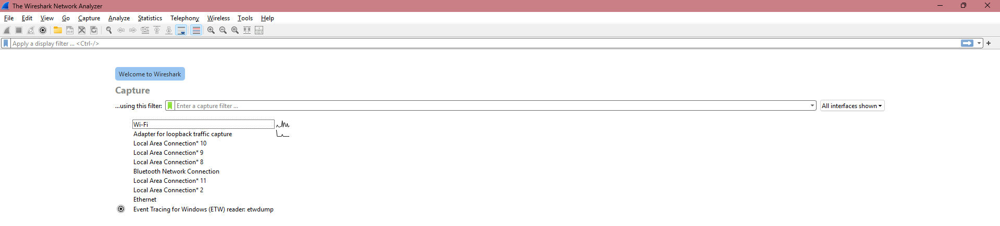
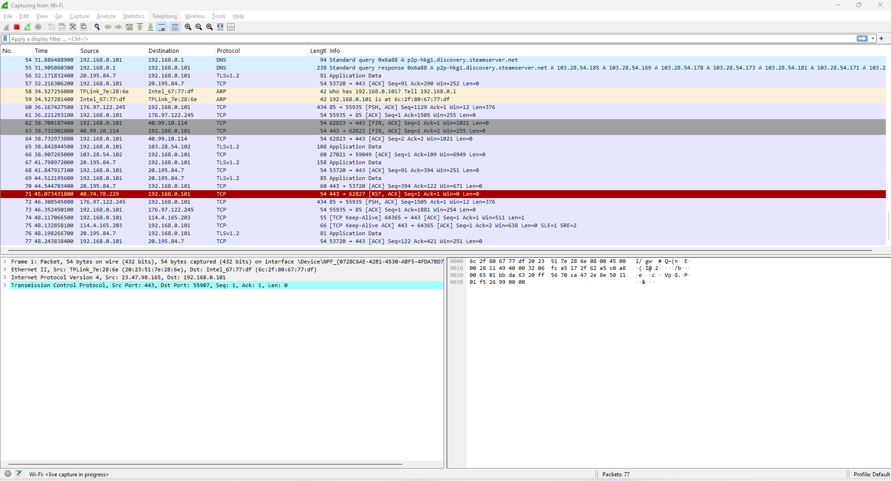
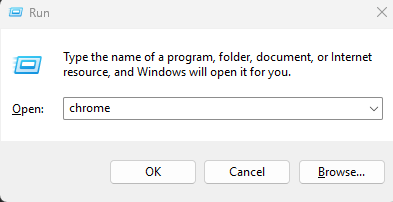
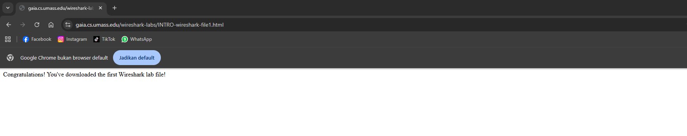
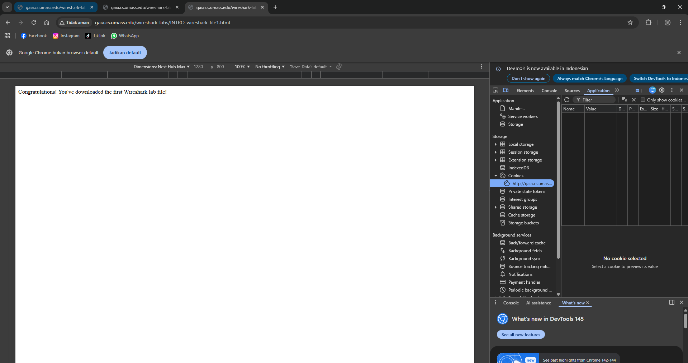
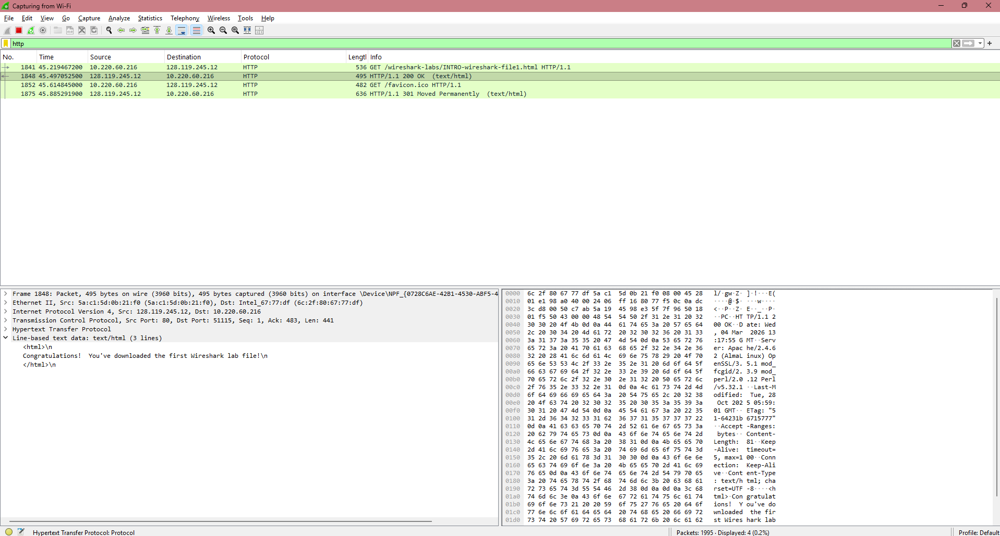
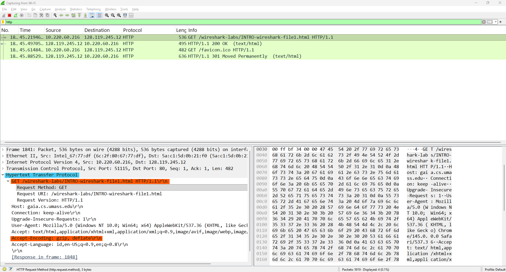

# Laporan Jaringan Komputer Informatika Week 2

   Sebelum jauh lebih dalam mengenai jaringan dan software yang digunakan, di perlukannya perkenalan terlebih dahulu dengan tools yang dimiliki oleh waveshark. Disini untuk interface yang digunakan sendiri adalah WIFI karena untuk ethernet masih belum bisa digunakan pada saat praktikum sebelumnya dan sebenarnya juga kurang lebih sama karena hal yang akan dilakukan adalah melakukan pengecekan lalu lintas jaringan sesuai case yang ada di modul. Berikut dibawah ini penerapan praktikum modul 2.

## Configuration State
1. 
Seperti pada gambar dibawah ini, ini merupakan tampilan awal dari waveshark sendiri. terdapat beberapa interface salah satunya adalah WIFI yan

    
2. 
Maka akan muncul tampilan seperti dibawah ini. gambar ini menunjukan beranda atau main frame pada waveshark untuk memantau aktivitas jaringan yang keluar ataupun masuk pada device yang kita miliki. Salah satunya panel pada gambar dibawah ini adalah packet – listing yang Dimana menampilkan ringkasan satu baris untuk setiap paket yang diambil, termasuk nomor paket saat paket ditangkap , sumber paket dan Alamat tujuan, jenis protocol, dan informasi khusus protocol yang terkandung dalam paket. Selain itu juga ada command menu, ini biasanya terletak pada bagian atas jendela wireshark berguna untuk menyimpan data paket yang diambil atau membuka file yang berisi data paket yang diambil sebelumnya dan keluar dari aplikasi wireshark.

    
3. 
Setelah mengenal beberapa tools pada wireshark Sekarang melakukan percobaan untuk membuka website dengan port 80 atau biasa disebut dengan http. Caranya adalah menekan tombol perintah win + r dan mengisi pada kolom seperti pada gambar dibawah dengan chrome. Setelah selesai menekan tombol enter untuk memulai membuka.

    
4. 
Lalu pada chrome masuk salah satu website sesuai modul yaitu http://gaia.cs.umass.edu/wiresharklabs/INTRO-wireshark-file1.html. Maka akan tampil html yang berisikan beberapa kata dan disarankan pada saat ingin masuk website tersebut pastikan pada search bar benar – benar tertulis http bukan https.

    
5. 
Masuk pada element inspect untuk mode developer dimana akan melakukan reset terhadap cookie agar proses lalu lintas package dapat terlihat pada wireshark. Seperti pada gambar dibawah ini masuk pada menu Application dan mencari Cookie, setelah berhasil ditemukan memilih clear dan Kembali pada wireshark.

    
6. 
Terlihat seperti gambar dibawah dengan ada angka 200 dan infomasi “OK” menandakan pengiriman atau request antar package berhasil dilakukan. Contoh pada gambar dibawah ini juga pada line-based tertera file html yang dimiliki sesuai dengan isi pada website sebelumnya. Dan disebelah kanan yaitu ada package – content yang dimana menampilkan seluruh isi frame yang diambil, baik dalam format ASCII maupun hexadecimal.

    
7. 
7.	Juga dibawah ini terdapat penjelasan lebih detail atau informasi lebih detail mengenai lalu llintas package pada bagian Hypertext Transfer Protocol dimana ia mendapatkan HTTP GET yang dikirim dari computer kita ke server HTTP dari jendela WireShark yang menunjukan “GET” diikuti oleh URL yang dimasukkan. Saat kita memilih pesan HTTP GET, frame ethernet , datagram IP, segmen TCP, dan informasi header pesan HTTP akan ditampilkan dijendela header package 3.

    