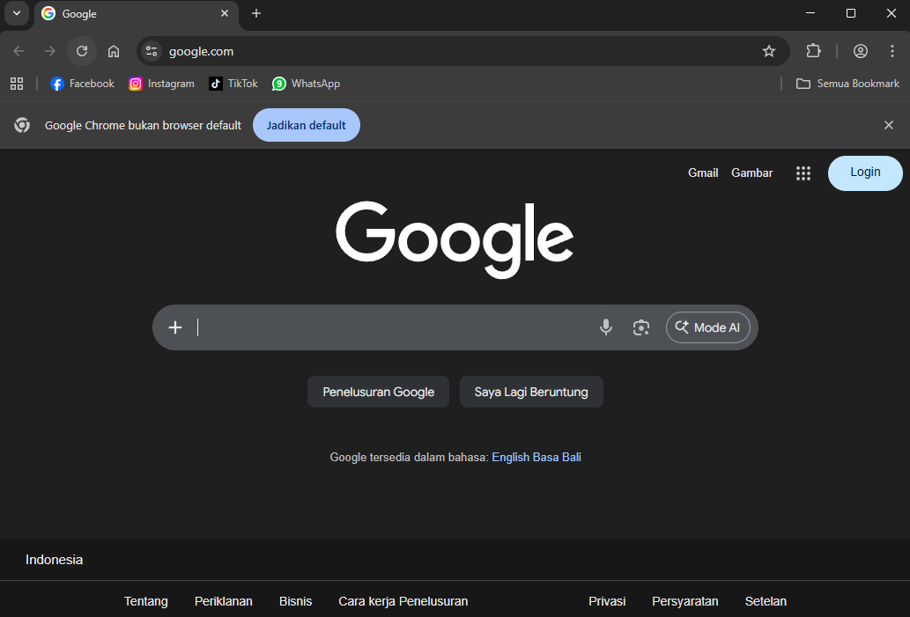
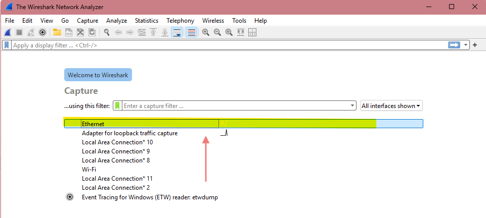
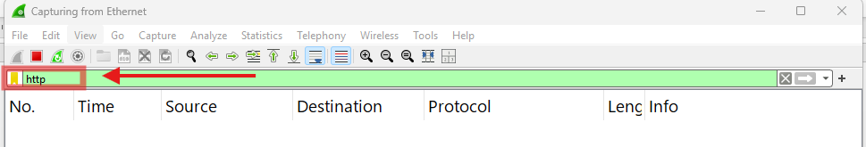
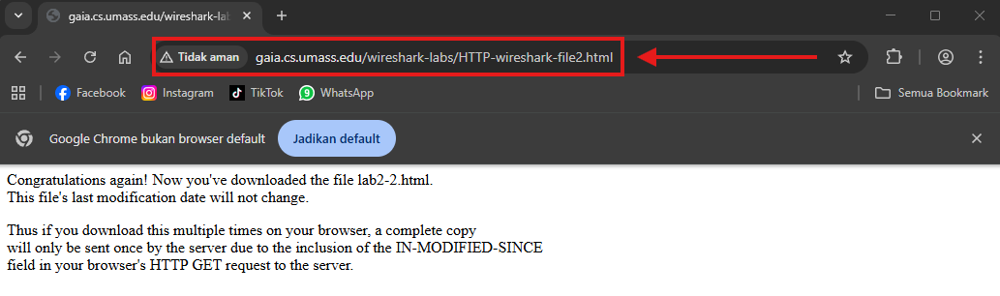
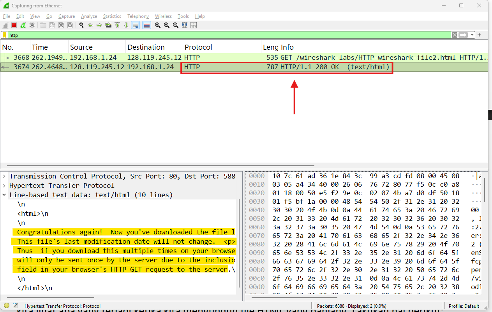
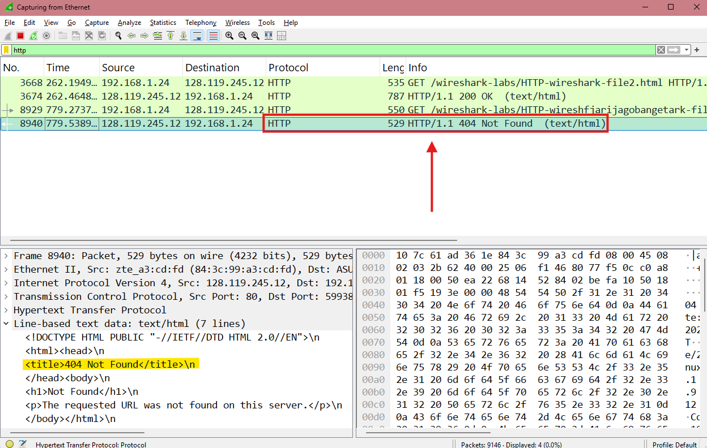
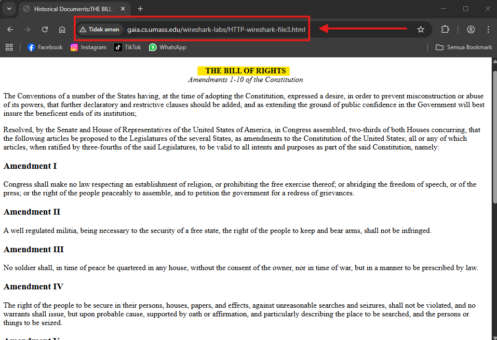
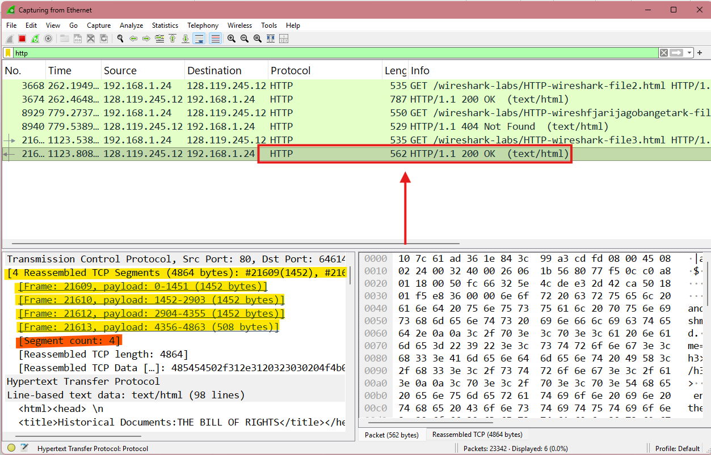

# Laporan Jaringan Komputer Informatika Week 3

## HTTP

Di karenakan sebelumnya telah mempelajari atau perkenalan dengan wireshark pada praktikum di week 3 ini akan masuk pada materi HTTP. Di dalam wireshark sering kali melihat beberapa protocol yang berjalan. Tugasnya pada praktikum ini adalah mengimplementasikan atau menganalisa basic dari HTTP tentang interaksi GET/Response, pesan HTTP, dan beberapa hal yang berkaitan dengan HTML. Sebelum melanjutkan implementasi mungkin sedikit penjelasan mengenai tentang HTTP yang merupakan protocol yang berfungsi untuk tempat pertukaran data di World Wide Web atau biasa disebut dengan WWW. Di sini HTTP mengatur client dan server dalam meminta dan menerima material dari sisi server. Karakteristiknya sendiri ia mereka berjalan di atas model permintaan – respon. Setelah mengetahui definisinya masu pada tahap praktikum.

### A. Basic HTTP GET

Pada basic HTTP ini saat ingin mengetikkan URL browser mengirimkan permintaan GET. cara ini digunakan untuk mengambil data dari server. Server menerima permintaan dan mencari file yang diminta, lalu mengirimnya Kembali. Berikut mungkin beberapa tanggapan  atau respon dengan paket informasi yang berisi dua bagian.

* **Status Code**: Angka tiga digit yang memberi tahu apakah permintaan berhasil.
    * 200: Menandakan bahwa datanya ada dan berhasil.
    * 400: Error atau datanya tidak dapat dijangkau atau tidak ditemukan.
    * 500: Biasanya pada sisi ini kesalahan pada server itu sendiri ntah karena server down karena kebanyakan permintaan, dll.
* **Content**: biasanya berisikan data yang diminta berupa  HTML, gambar, atau data seperti contohnya JSON. 
#### Implementasi
1. 
Ini merupakan Langkah awal basic HTTP GET dengan cara masuk pada browser untuk memulai implementasi.

    
2. 
Membuka WireShark dan memilih interface Ethernet karena pada praktikum kali ini divice yang dimiliki terhubung langsung dengan LAN.

    
3. 
Pada display filter mengetikkan perintah http yang berfungsi agar hanya pesan HTTP yang akan ditampilkan pada daftar paket.

    
4. 
Menunggu berkisar satu menit untuk sinkronasi agar wireshark dapat mencatat semua lalu lintas paket data yang lewat yang kemudian lanjut pada web browser untuk masuk pada website http://gaia.cs.umass.edu/wireshark-labs/HTTP-wireshark-file1.html sesuai link yang diberikan oleh modul. 

    
5. 
Berikut dibawah ini adalah hasil gambar catatan lalu lintas dengan filter HTTP yang sudah masuk pada wireshark. Sesuai dengan akses di browser dengan tampilan congratulation maka HTTP akan mengeluarkan status code “200 OK”.

    
6. 
Berikut dibawah ini juga jika user gagal meminta sebuah permintaan pada server. Maka code nontification akan muncul 404 sesuai dengan penjelasan diatas sebelumnya.

    

### 3.3 Retrieving Long Documents

Disini melanjutkan implementasi seperti contoh diatas namun dengan mengambil dokumen file HTML yang Panjang dengan website yang berbeda. Berikut ini adalah link website yang harus dikunjungin http://gaia.cs.umass.edu/wireshark-labs/HTTP-wireshark-file3.html . Implementasi cara yang digunakan juga sama maka disini akan langsung lompat pada bagian pada masuk website dan juga hasilnya.

#### Implementasi
1. 
Mengetikan website yang telah dijabarkan pada HTTP Conditional GET dan memuatnya dengan HTTP tidak dengan HTTPS.

    
1. 
Berikut dibawah ini merupakan hasil dari HTML dengan multi TCP segments sebanyak 4 frame. Dimana ini merupakan ukuran yang sangat besar sekisar 4864 byte. Sehingga menunjukan setiap segmen TCP sebagai paket terpisah.

    
