# Laporan Jaringan Komputer Informatika Week 4

## DNS

Domain name system itu berguna untuk mentranslasikan nama host ke bentuk alamat IP. Jadi pada praktikum minggu ini hanya menggunakan client untuk mengirimkan permintaan ke server DNS lokal dan menerima respons balik.

### A. Nslookup

Nslookup sendiri memiliki kegunaan untuk menguji atapun mengdiagnosa infrastruktur DNS. atau secara sederhananya ini merupakan alat untuk semacam tanya jawab antara komputer kamu dengan server DNS untuk menerjemahkan nama domain menjadi alamat IP, atau sebaliknya. kegunaan lainnya biasanya seorang teknisi akan mempergunakannya seperti Mengetahui Alamat IP Situs Web dan Melakukan Reverse Lookup. berikut dibawah ini contoh praktikum yang bisa diimplementasikan.

    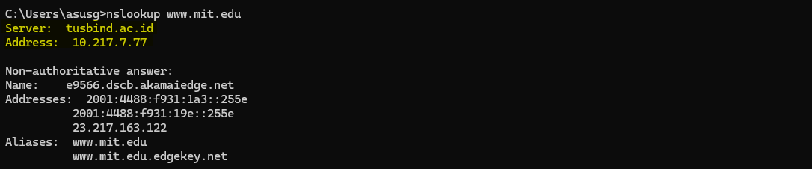

Jadi diatas merupakan contoh sederhana untuk bisa melihat alamat IP ataupun nama domain. contoh  yang digunakan adalah alamat dari website www.mit.edu sesuai dengan modul. selanjutnya akan membuat eksperimen dengan menggunakan opsi "-type=NS" dan domain "mit.edu". disini akan menyebabkan nslookup mengirimkan permintaan untuk record tipe-NS ke default server DNS lokal. berikut contoh yang bisa di implementasikan

    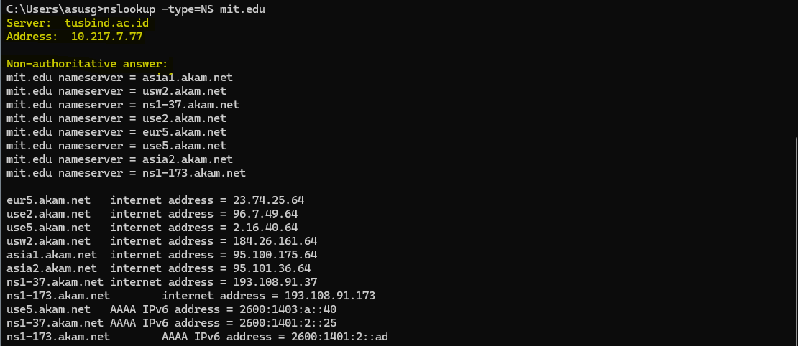

Selanjutnya kita ingin permintaan dikirim ke server DNS bitsy.mit.edu, bukan ke default server
DNS. Dengan ini, pertukaran informasi akan terjadi secara langsung antara host yang mengajukan permintaan dan bitsy.mit.edu. Dalam contoh ini, server DNS bitsy.mit.edu memberikan alamat IP dari host www.aiit.or.kr yang merupakan server web di Advanced Institute of Information Technology. Berikut contoh yang bisa dimuat.

    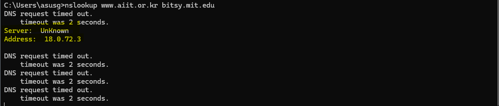

Hal yang terjadi seperti diatas harusnya terdapat beberapa yang menjadi problem misalnya adalah server bisa jadi tidak merespon ataupun konfigurasi firewall oleh sebuah instansi. jadi pada study kasus diatas tersebut kita ingin permintaan dikirim ke server DNS bitsy.mit.edu, bukan ke default server DNS. Oleh karena itu pertukaran informasi akan terjadi secara langsung antara host yang mengajukan permintaan dan bitsy.mit.edu.

    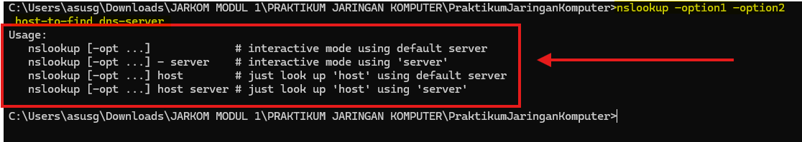

 Selanjutnya mencoba syntax yaitu nslookup –option1 –option2 host-to-find dns-server. dimana ini merupakan cara untun mendiagnosa ataupun mengambil informasi dari DNS. jadi strukturnyanya itu nslookup itu nama program/perintahnya sendiri, lalu –option1 –option2 merupakan argumen tambahan untuk memodifikasi hasil pencarian, selanjutnya host-to-find dimana ini merupakan domain atau alamat yang ingin dicari informasinya contohnya www.mit.edu. dan terakhir dns-server, ini bagian yang bisa bertanya ke server DNS secara spesifik.

 Selanjutnya masuk pada tahap pengujian mandiri. terdapat beberapa pertanyaan pada modul yang bisa di implementasikan yaitu.

* **Pertanyaan**
    * 1. Jalankan nslookup untuk mendapatkan alamat IP dari server web di Asia. Berapa alamat IP server tersebut?
    * 2. Jalankan nslookup agar dapat mengetahui server DNS otoritatif untuk universitas di Eropa.
    * 3. Jalankan nslookup untuk mencari tahu informasi mengenai server email dari Yahoo! Mail melalui salah satu server yang didapatkan di pertanyaan nomor 2. Apa alamat IP-nya?
* **Implementasi/Jawaban**  
    * 1. Jadi IP yang bisa di dapat adalah 114.4.166.189 dimana ini merupakan lokasi fisik server Alibaba. sementara 192.168.0.1 merupakan alamat IP dari router lokal yang bertindak sebagai DNS resolver.
         
         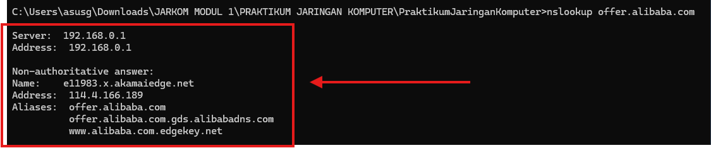
    * 2. implementasi untuk mengetahui server DNS otoritatif untuk universitas di Eropa. salah satu contoh yang bisa di buat adalah oxford. untuk mencarinya disini menggunakan -type=ns untuk melihat server mana yang memegang otoritas. selain itu didapat salah satu contohnya adalah "ox.ac.uk nameserver = dns0.ox.ac.uk"
         
         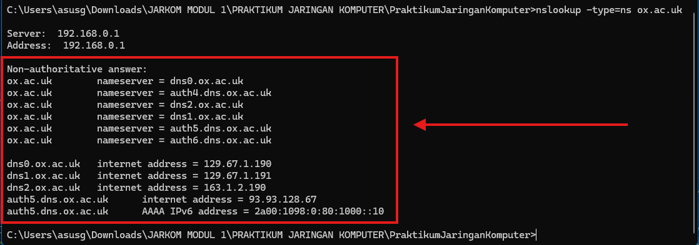
    * 3. Karena oxford dikonfigurasi sebagai Authoritative DNS ia hanya mau menjawab pertanyaan tentang domain mereka sendiri. mereka menolak atau disebut refused karena mereka tidak mau melayani pencarian domain luar bagi pengguna publik. namun misal menggunakan domain google yaitu 8.8.8.8 ia akan memproses seperti dibawah ini. maka kita telah mendapatkan informasi mengenai server email dari Yahoo.

         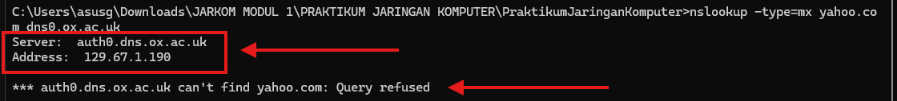
        * Contoh dibawah ini milik google.

             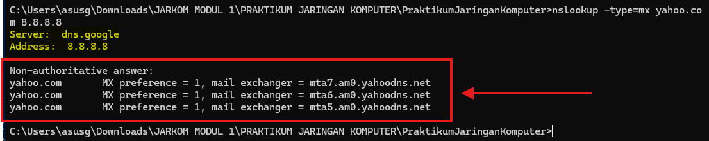
### B. IPConfig       

Masuk pada sub-bab IPConfig, IPConfig sendiri merupakan perintah dasar untuk menampilkan semua rincian konfigurasi jaringan yang sedang aktif pada komputer. biasanya kegunaannya untuk melihat IPv4 ataupun IPv6, mengecek gateway, ataupun identifikasi koneksi. berikut contoh implementasi yang bisa dibuat dengan menggunakan syntax ipconfig /all untuk melihat semua jaringan yang terhubung pada perangkat.

    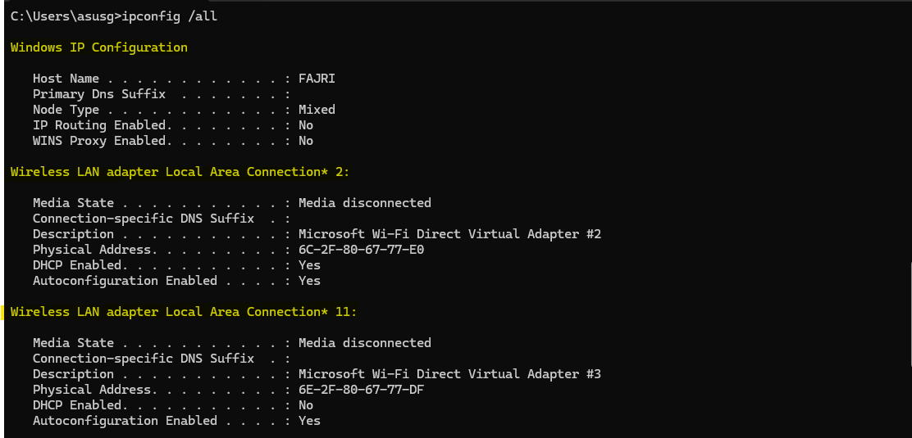

Selain itu IPConfig berguna untuk mengelola informasi DNS yang tersimpan dalam host dan mengirimnya berupa document. berikut tahapan awal yang bisa diimplementasikan. membuat syntax ipconfig /displaydns seperti pada gambar dibawah ini.

    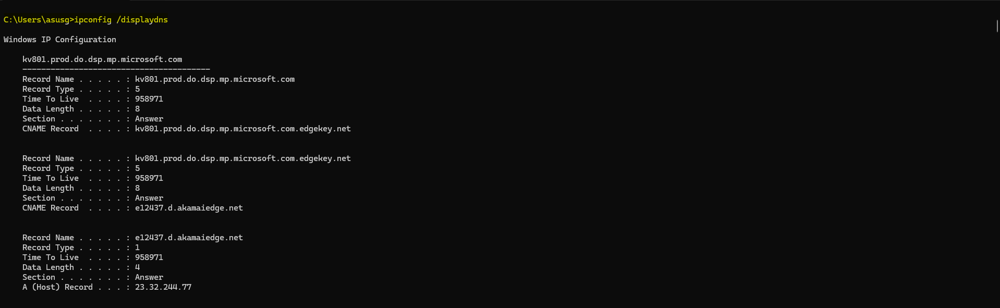

Selanjutnya Hasil yang didapatkan akan menampilkan record dan sisa Time To Live dalam satuan detik. Untuk menghapus cacatan. berikut dibawah ini implementasi yang bisa dibuat dengan menggunakan syntax ipconfig /flushdns.

    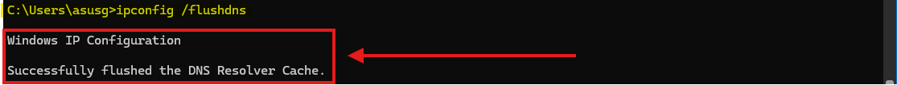

 Seperti implementasi diatas maka akan Mengosongkan catatan DNS yang berarti menghapus semua record dan memuat ulang record dari file host.

### C. Tracing DNS dengan Wireshark

 Karena beberapa implementasi seperti diatas telah berhasil dilakukan seperti nslookup ataupun ipconfig selanjutnya masuk pada software wireshark dimana praktikum ini akan melakukan penyelesaian masalah yang lebih serius. sesuai arahan dengan modul langkah pertama akan menggunakan IPConfig untuk mengosongkan catatan DNS di host 

    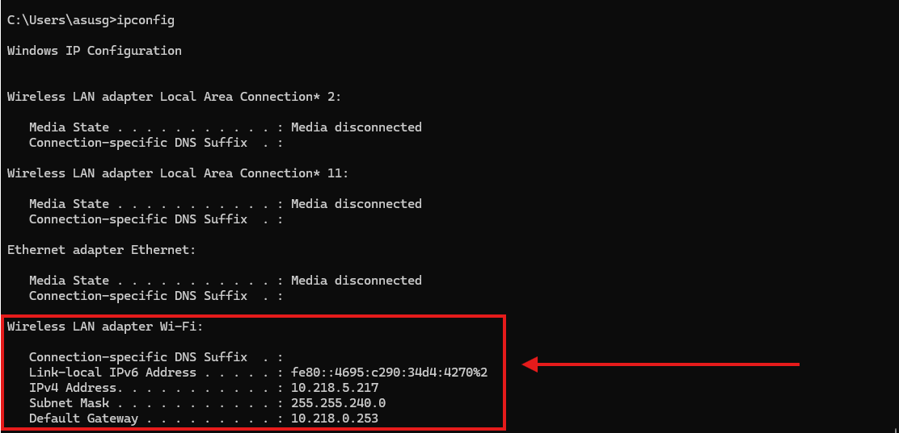  

 Selanjutnya membuka browser dan mengosongkan cachenya. contoh beberapa aktivias pada browser agar tidak preload sehingga mempercepat proses loading pada web tersebut. selain itu juga agar menjalankan proses baru pada wireshark agar mudah ter-track.

    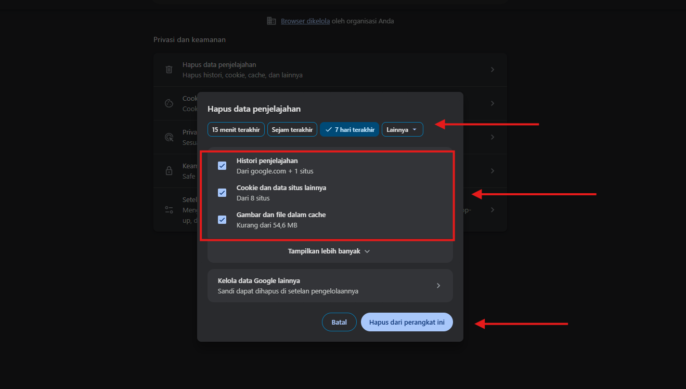  

 Berikutnya membuka software wireshark dan memasukkan filter pada search filter yaitu sesuai arahan modul "ip.addr == 10.218.5.217". filter yang digunakan ini akan menghapus semua paket yang tidak berasal atau ditujukan ke host. kegiatan ini sekaligus akan melakukan pengambilan paket di Wireshark.

    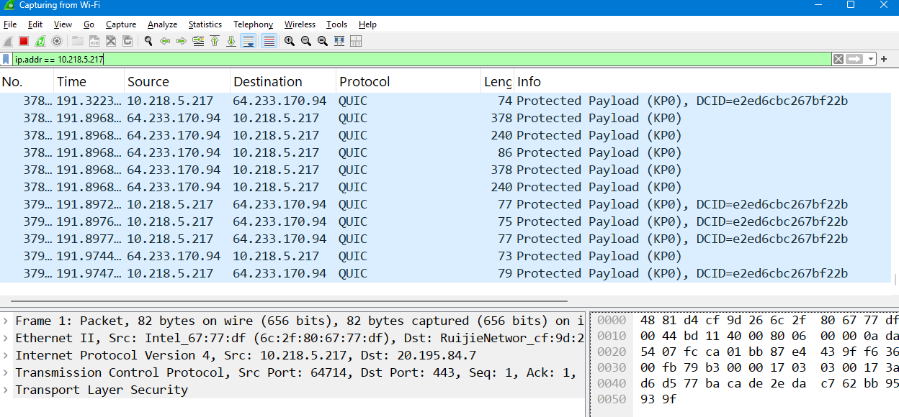 

Selanjutnya mengunjungi alamat sesuai arahan modul yaitu www.ietf.org dan selanjutnya menghentikan pengambilan paket pada wireshark.

    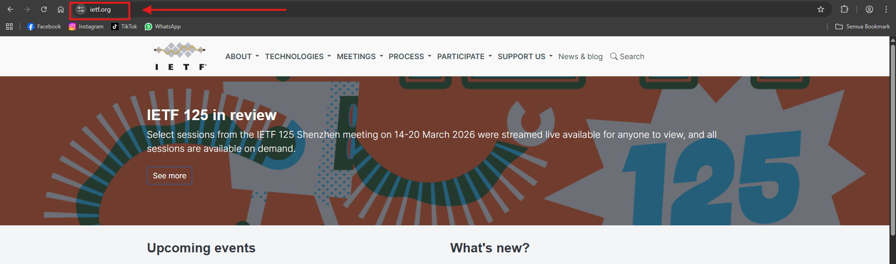 

Kemudian mencoba menjawab beberapa pertanyaan yang diberikan oleh modul seperti penjelasan dibawah ini.

* **Pertanyaan** 
    * 1. Cari pesan permintaan DNS dan balasannya. Apakah pesan tersebut dikirimkan melalui UDP atau TCP?
    * 2. Apa port tujuan pada pesan permintaan DNS? Apa port sumber pada pesan balasannya?
    * 3. Pada pesan permintaan DNS, apa alamat IP tujuannya? Apa alamat IP server DNS lokal anda (gunakan ipconfig untuk mencari tahu)? Apakah kedua alamat IP tersebut sama?
    * 4. Periksa pesan permintaan DNS. Apa “jenis” atau ”type” dari pesan tersebut? Apakah pesan permintaan tersebut mengandung ”jawaban” atau ”answers”?
    * 5. Periksa pesan balasan DNS. Berapa banyak ”jawaban” atau ”answers” yang terdapat di dalamnya? Apa saja isi yang terkandung dalam setiap jawaban tersebut?
    * 6. Perhatikan paket TCP SYN yang selanjutnya dikirimkan oleh host Anda. Apakah alamat IP pada paket tersebut sesuai dengan alamat IP yang tertera pada pesan balasan DNS?
    * 7. Halaman web yang sebelumnya diakses www.ietf.org memuat beberapa gambar. Apakah host Anda perlu mengirimkan pesan permintaan DNS baru setiap kali ingin mengakses suatu gambar?

* **Implementasi/Jawaban**
    * 1. Jadi pesan yang dikirimkan oleh server adalah UDP dimana berisikan 30 bytes. seperti contoh pada gambar dibawah ini.

         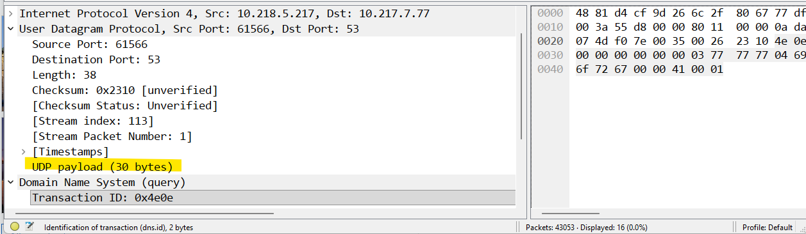
    * 2. Untuk port tujuan yang diberikan adalah 61566 dengan sumber port yang diberikan yaitu 53.

         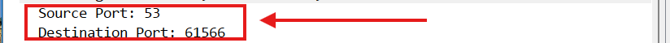
    * 3. Jadi setelah melakukan penerapan implementasinya berikut seperti dibawah ini yang bisa dimuat contoh ip lokal yang didapat adalah 10.218.5.217 dimana gatewaynya adalah 10.218.0.253. dan dns milik server tersebut adalah 23.217.163.122. dimana ini merupakan dns yang bisa didapat melalui perantara ISP sedangkan 10.217.7.77 milik lokal.

          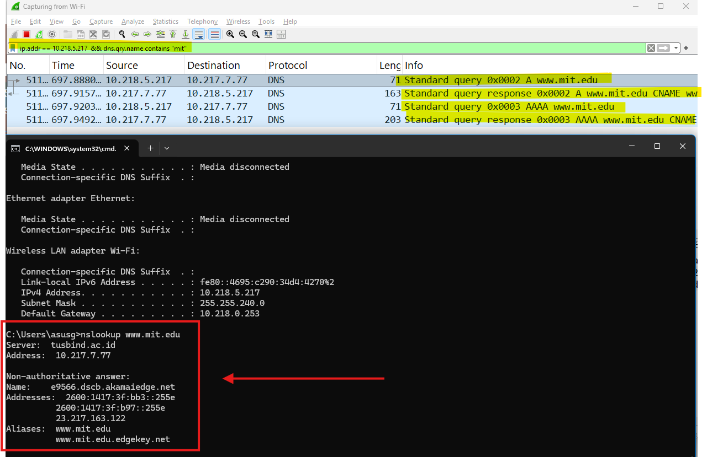
    * 4. Memeriksan DNS dari jenis ataupun type apakah muncul sebuah jawaban. setelah melakukan peneran pada wireshark tidak ditemukannya jawaban atau tampilannya 0 seperti gambar dibawah ini.

         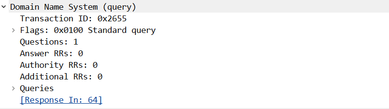
    * 5. Setelah melakukan implementasi dengan menggunakan beberapa filter terdapat jawaban yang terkandung yaitu name, type, class, ttl, data length, svcpriority, dan terakhir adalah targetname.

          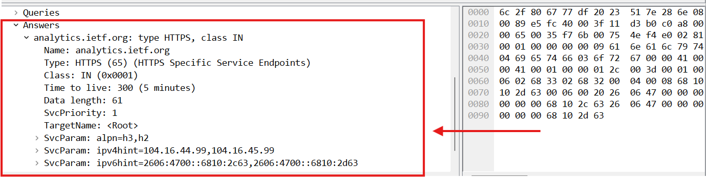
    * 6. Iya telah sesuai karena sebelumnya pada saat melakukan pengecekan melalui nslookup alamat 104.16.44.99 adalah salah satu dari Addresses yang diberikan oleh server DNS.

         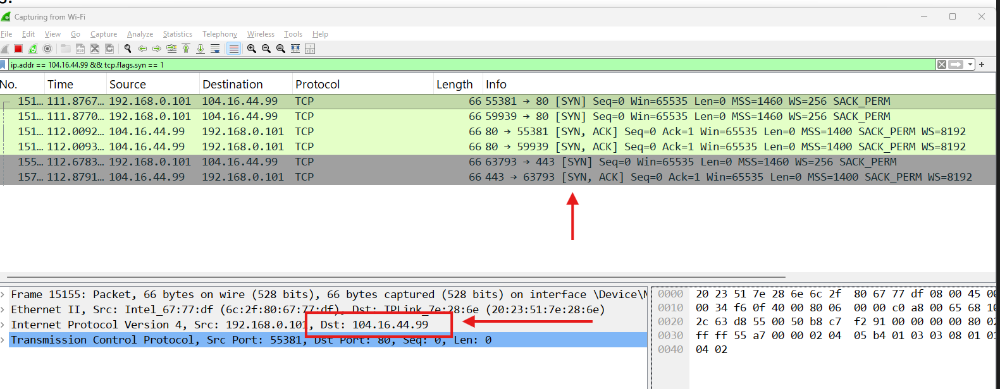
    * 7.  Tidak karena komputer melakukan lookup pertama kali untuk www.ietf.org, maka hasilnya akan disimpan di dalam DNS Cache lokal. Karena IP-nya diketahui komputer tidak perlu bertanya lagi ke server DNS.
         
         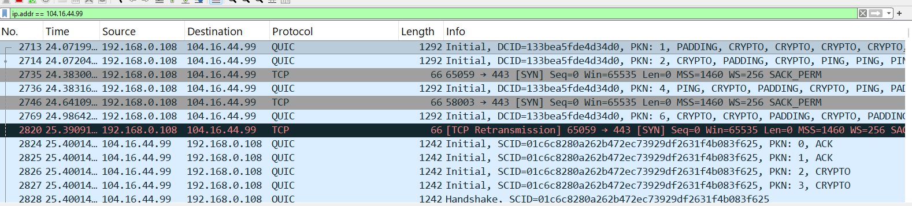

Selanjutnya adalah menjawab beberapa pertanyaan kembali sesuai dengan arahan modul yaitu mengabaikan  dua pasangan permintaan-balasan pertama karena mereka merupakan paket yang khusus dihasilkan oleh nslookup. kita  cukup fokus pada pesan permintaan dan balasan terakhir. berikut beberapa pertanyaan yang bisa dijawab yaitu.

1. Apa port tujuan pada pesan permintaan DNS? Apa port sumber pada pesan balasan DNS?

     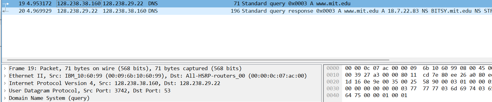
     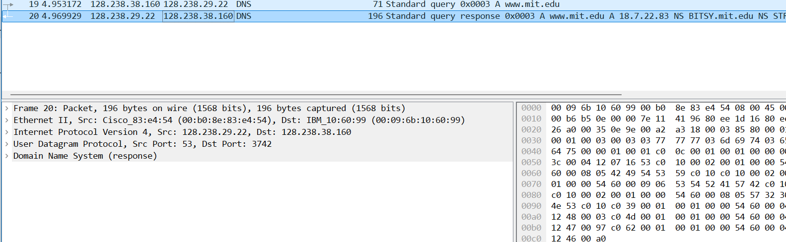

2. Ke alamat IP manakah pesan permintaan DNS dikirimkan? Apakah alamat IP tersebut merupakan default alamat IP server DNS lokal Anda?

3. Periksa pesan permintaan DNS. Apa ”jenis” atau ”type” dari pesan tersebut? Apakah pesan tersebut mengandung ”jawaban” atau ”answers”?

4. Periksa pesan balasan DNS. Berapa banyak ”jawaban” atau “answers” yang terdapat di dalamnya. Apa saja isi yang terkandung dalam setiap jawaban tersebut?
