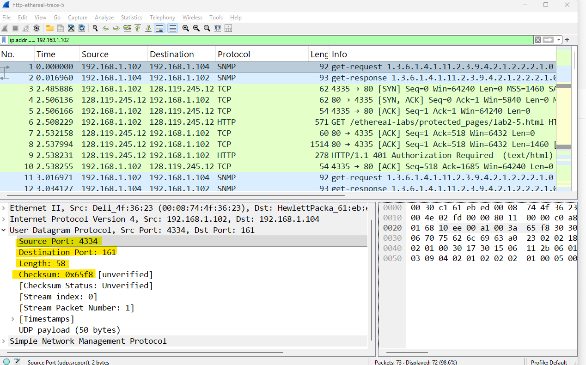
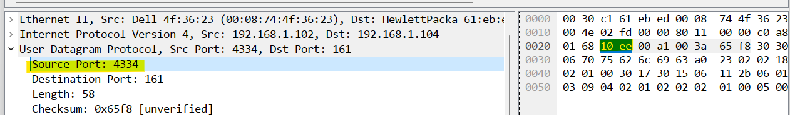

# Laporan Jaringan Komputer Informatika Week 5

## UDP

 UDP merupakan protokol dari IPS atau biasa disebut dengan Internet Protocol Suite yang digunakan untuk mengirimkan data di jaringan komputer. karakteristiknya yaitu UDP tidak melakukan handshake, ia akan langsung mengirimkan data ke alamat tujuan tanpa mengetahui apakah penerima sudah siap atau belum. Berikutnya Karena tidak perlu mengecek tanda terima atau mengurutkan data, overhead UDP sangat kecil. Header UDP hanya berukuran 8 byte, sedangkan TCP minimal 20 byte. Jadi UPD digunakan pada saat Streaming video, bermain game online, dan bisa juga untuk VoIP. berikut dibawah ini beberapa pertanyaan yang harus dijawab sesuai arahan modul yaitu.

* **Pertanyaan**
    * 1. Pilih satu paket UDP yang terdapat pada trace Anda. Dari paket tersebut, berapa banyak “field” yang terdapat pada header UDP? Sebutkan nama-nama field yang Anda temukan!
    * 2. Perhatikan informasi “content field” pada paket yang Anda pilih di pertanyaan 1. Berapa panjang (dalam satuan byte) masing-masing “field” yang terdapat pada header UDP?
    * 3. Nilai yang tertera pada ”Length” menyatakan nilai apa? Verfikasi jawaban Anda melalui paket UDP pada trace.
    * 4. Berapa jumlah maksimum byte yang dapat disertakan dalam payload UDP? (Petunjuk: jawaban untuk pertanyaan ini dapat ditentukan dari jawaban Anda untuk pertanyaan 2)
    * 5. Berapa nomor port terbesar yang dapat menjadi port sumber? (Petunjuk: lihat petunjuk pada pertanyaan 4)
    * 6. Berapa nomor protokol untuk UDP? Berikan jawaban Anda dalam notasi heksadesimal dan desimal. Untuk menjawab pertanyaan ini, Anda harus melihat ke bagian ”Protocol” pada datagram IP yang mengandung segmen UDP.
    * 7. Periksa pasangan paket UDP di mana host Anda mengirimkan paket UDP pertama dan paket UDP kedua merupakan balasan dari paket UDP yang pertama. (Petunjuk: agar paket kedua  merupakan balasan dari paket pertama, pengirim paket pertama harus menjadi tujuan dari paket kedua). Jelaskan hubungan antara nomor port pada kedua paket tersebut!

* **Implementasi/Jawaban** 
    * 1. Jadi terlihat pada gambar ada 4 field utama dalam sebuah header UDP yaitu Source Port menunjukkan port pengirim bernilai 4334, lalu Destination Port menunjukkan port tujuan yaitu 161 yang merupakan port standar untuk protokol SNMP, kemudian ada length menunjukkan panjang total UDP bernilai 58 byte, dan terakhir adalah checksum digunakan untuk pemeriksaan kesalahan pada header dan data yang bernilai 0x65f8.

         
    * 2. Untuk masing - masing panjang setiap field pada header UDP adalah 2 byte dan panjang bitnya adalah 16 jika ditotal untuk byte adalah 8 byte. bisa dilihat seperti pada panjang data payload di dalamnya adalah 50 byte 58 - 8 = 50. 

         
    * 3. Nilai pada field Length dalam header UDP panjang total paket UDP dalam satuan byte, yang terhitung headernya adalah 8 byte ditambah dengan Data Payload seperti penjelasan pada nomor 2. jadi terdapat juga rumus untuk menghitungnya yaitu length = panjang heade + panjang payload. dimana implementasi ini yang bisa dilihat adalah 58 = 8 + 50 hasilnya masuk akal yaitu berjumlah 58.

         
    * 4. Maka seperti pada pertanyaan pada nomor 2. field Length pada header UDP memiliki panjang 2 byte yang di total berjumlah 16 bit. dalam biner nilai maksimum yang dapat ditampung oleh 16 bit adalah $2^{16} - 1$. jadi jika di total nilai maksimum untuk field Length adalah 65.535 byte. untuk Nilai 65.535 itu adalah total panjang header + payload. untuk tau jumlah maksimum payload dilakukan pengurangan nilai tersebut dengan ukuran header UDP yaitu 8 byte. yaitu maximum payload = 65.535 - 8 = 65.527 byte. jadi maximum byte di payload udp adalah 65.527 byte.

    * 5. Jadi setelah mengidentifikasi field Source Port memiliki panjang 2 byte atau 16 bit. maka nomor port terbesar yang bisa digunakan sebagai port sumber adalah 65.535. sesuai dengan $$2^{16} - 1 = 65.535$$
    
    * 6.
    * 7.