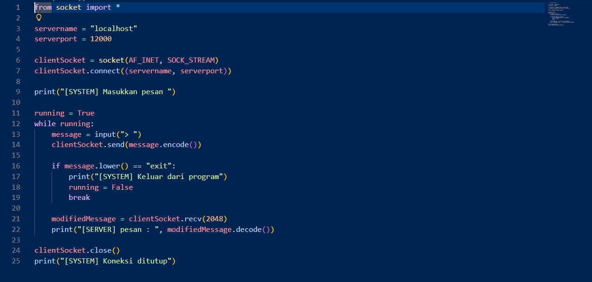
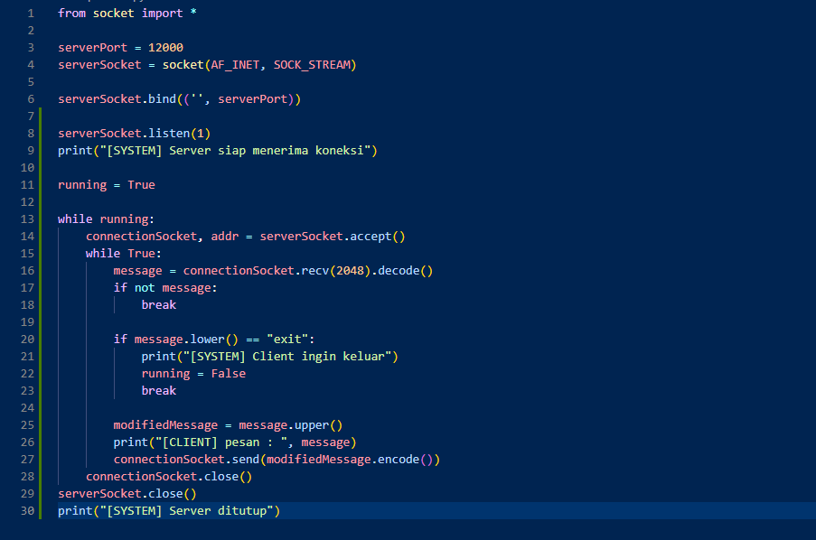
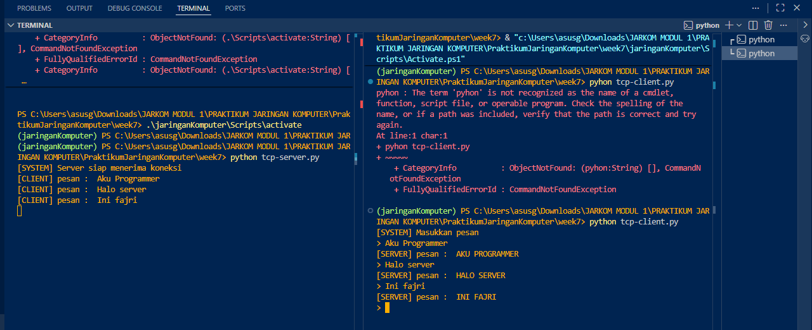
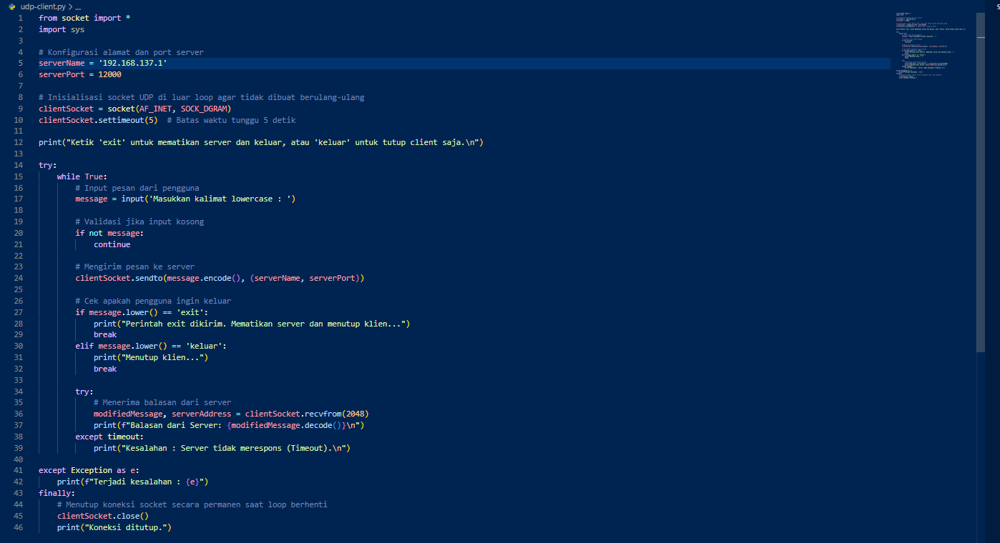

# Laporan Jaringan Komputer Informatika Week 7

## SOCKET PROGRAMMING

   Typical network application itu terdiri dari sepasang program program client dan program server yang berada di dua sistem akhir yang berbeda. Ketika kedua program ini dijalankan, proses client dan proses server dibuat, dan proses ini berkomunikasi satu sama lain dengan membaca dari, dan menulis ke, soket. Saat membuat aplikasi jaringan, tugas utama developer adalah menulis kode untuk program klien dan server. Ada dua jenis network applications yaitu implementasi yang operasinya ditentukan dalam standar protokol dan proprietary network application dimana program klien dan server menggunakan protokol an application-layer yang belum dipublikasikan secara terbuka
di RFC atau di tempat lain. developer membuat program klien dan server, dan developer memiliki kendali penuh atas apa yang ada dalam kode. Tetapi karena kode tersebut tidak mengimplementasikan open protocol, developer independen lainnya tidak akan dapat mengembangkan kode yang beroperasi dengan aplikasi tersebut.

### B. Program Socket dengan UDP

   Melihat interaksi antara dua proses komunikasi yang menggunakan soket UDP. Sebelum proses pengiriman dapat mendorong paket data keluar dari pintu soket, saat menggunakan UDP, terlebih dahulu harus melampirkan alamat tujuan ke paket. Setelah paket melewati soket pengirim, Internet akan menggunakan alamat tujuan ini untuk merutekan paket melalui Internet ke soket dalam proses penerima. Ketika paket tiba di soket penerima, proses
penerima akan mengambil paket melalui soket, dan kemudian memeriksa isi paket dan mengambil tindakan yang tepat. 

#### C. UDP-Client.py

Berikut dibawah ini implementasi yang bisa dimuat untuk praktikum week 7 yaitu.

    

Jadi alur program diatas diawali dari mengimport socket untuk kebutuhan komunikasi jaringan dan sys untuk fungsionalitas sistem. kemudian Program menetapkan identitas server melalui IP dan port dan juga membuat objek socket dengan AF_INET untuk IPv4 dan SOCK_DGRAM untuk protokol UDP. Selain itu ada juga fitur settimeout(5) untuk mencegah program macet. Selanjutnya Program masuk kedalam perulangan menggunakan while True agar user dapat mengirim pesan berulang kali. di dalam loop ini program mengambil input teks dari pengguna. Jika inputnya adalah 'exit' atau 'keluar', program akan mengirimkan pesan itu ke server terlebih dahulu, kemudian menghentikan loop dengan break untuk menutup program. Jika inputnya itu teks biasa, pesannya akan diubah menjadi format byte menggunakan encode() dan dikirimkan ke alamat server yang telah ditentukan dengan fungsi sendto. Setelah data terkirim, program masuk ke try-except internal untuk menunggu balasan dari server menggunakan recvfrom(2048). Jika server merespons, pesan yang diterima akan didekode kembali menjadi teks dan ditampilkan ke layar. tapi, jika dalam 5 detik tidak ada jawaban, program akan melakukan timeout an menampilkan pesan kesalahan tanpa menghentikan program. dan semua proses akan dijadikan satu didalam finally.

#### D. UDP-Server.py

Berikut dibawah ini implementasi yang bisa dimuat.

    

 Program dimulai dengan membuat socket UDP yaitu SOCK_DGRAM. disini tidak seperti client, server harus melakukan bind, yaitu memasukkan port contohnya sesuai dengan praktikum yaitu 12000 agar sistem operasi tahu bahwa semua data yang masuk ke port tersebut harus diserahkan kepada program ini. kemudian Server masuk ke perulangan dengan while True yang membuatnya terus berjalan tanpa berhenti. Di dalam loop ini, fungsi serverSocket.recvfrom(2048) akan memblokir eksekusi program sampai ada data yang datang dari client. Ketika data datang, server mendapatkan dua sesuatu yaitu pesan, dan juga alamat pengirim. Setelah pesan diterima dan didekode menjadi teks, server melakukan pengecekan kondisi. Jika client mengirimkan 'exit', server akan ngeprint pesan penutup dan keluar dari perulangan.nah disini jika pesan berupa teks biasa, server akan mengubah teks itu menjadi huruf kapital menggunakan fungsi .upper(). dan terakhir adalah mengirimkan kembali teks yang sudah diubah ke client menggunakan fungsi sendto, dengan clientAddress yang didapat sebagai tujuan. dan seluruh proses dijadikan satu dalam try-except-finally. dan contoh hasil dibawah merupakan output yang bisa di paparkan oleh program yaitu.

    

### E. Program Socket dengan TCP

 Selanjutnya adalah membuat program dengan socket yaitu TCP setelah melakukan praktikum dengan UDP. disini bahasa yang digunakan juga sama yaitu menggunakan python seperti sebelumnya. disini TCP merupakan protokol berorientasi koneksi. Ini berarti bahwa sebelum client dan server dapat mulai mengirim data satu sama lain, mereka harus terlebih dahulu handshake dan membuat koneksi TCP.Saat membuat koneksi TCP, kita mengaitkannya dengan alamat soket client dan alamat soket server. Dengan koneksi TCP dibangun, ketika satu sisi ingin mengirim data ke sisi lain, itu hanya memasukkan data ke dalam koneksi TCP melalui soketnya. berikut dibawah ini merupakan implementasi yang bisa diterapkan yaitu.

#### F. TCP-Client.py

Berikut dibawah ini program dari TCP Client dengan menggunakan bahasa pemrograman python dengan support beberapa library yang ada.

    

 Pertama program menginisiasi alamat server sebagai localhost dengan alamat host yaitu 12000 sesuai praktikum sebelumnya. kemudian saat membuat objek socket, digunakan SOCK_STREAM ini merupakan penanda bahwa komunikasi akan menggunakan protokol TCP. Setelah koneksi berhasil dibuat, program masuk ke dalam looping menggunakan while running. berbeda seperti sebelumnya itu UDP ini pengiriman data tidak lagi menggunakan sendto, melainkan menggunakan .send(). hal ini ada karena socket sudah terconnect atau mengingat alamat server tujuan sejak proses koneksi di awal. Sesuai dengan definisinya TCP ini akan mengirimkan data sampai ke tujuan dengan urutan yang benar dan tanpa kerusakan. Kemudian Sama seperti sebelumnya ada kondisi untuk berhenti. jika user mengetik "exit", pesan itu tetap dikirim ke server, dan variabel running diubah menjadi False untuk memutus loopn. Jika pesannya bukan perintah keluar, client akan menunggu balasan dari server melalui clientSocket.recv(2048). Setelah keluar dari loop, program menjalankan clientSocket.close().

#### G. TCP-Server.py

Berikut dibawah ini program dari TCP Server dengan menggunakan bahasa pemrograman python yaitu.

    

