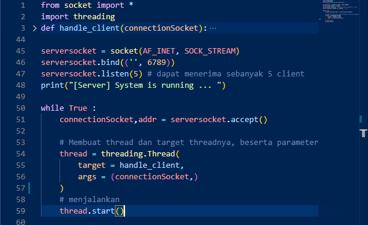
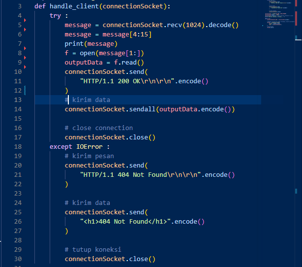
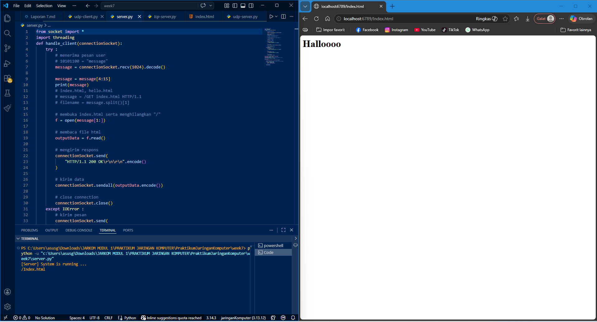
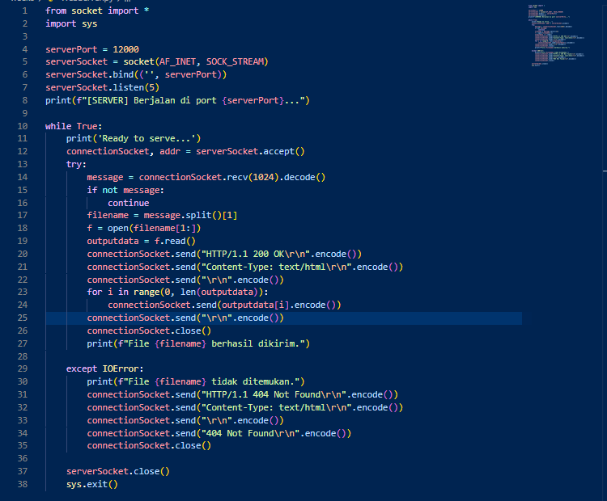

# Laporan Jaringan Komputer Informatika Week 9

## WEB SERVER

   Melakukan kegiatan pembelajaran dasar - dasar pemrograman socket untuk koneksi TCP dengan menggunakan bahasa pemograman yaitu Python. di dalam script yang dibuat terdapat hal dasar dilakukan yaitu cara setup socket, mengikat koneksi atau ngebind, serta mengirim dan menerima paket HTTP. Disini mahasiswa di minta untuk menangani server web dimana server tersebut harus bisa menerima dan mengurai permintaan HTTP. Mendapatkan file yang diminta dari sistem file server. Jika file yang diminta tidak ada di server, server harus mengirim pesan HTTP "404 Not Found" kembali ke user.  

### B. Menjalankan Server 

 Meletakkan file HTML 1 repository dengan server. seperti pada gambar dibawah ini

    

 Kemudian mengimplementasikan code program yang telah diberikan. berikut adalah alur program tersebut bekerja yaitu pertama mengimport socket semua di library yang berkaitan dengan networking. kemudian setup threding yang digunakan untuk menangani banyak client secara bersamaan. lalu membuat function untuk menghandle client dengan parameter connectionSocket yang digunakan sebagai endpoint untuk mengirim dan menerima data antar aplikasi. kemudian menyiapkan serversocket dimana nilai dari socket yang berisikan AF_INET (digunakan untuk membaca IPv4) dan SOCK_STREAM untuk TCP. Lalu menyiapkan serversocket.bind dimana ini berfungsi untuk mengikat koneksi tertentu agar dapat terhubung. lalu serersocket/listen bertujuan untuk agar dapat mendengar seberapa banyak client yang dapat ditangani. lalu setelah semua disetup membuat console.log agar dev tau bahwa server berhasil berjalan. kemudian membuat kondisi menggunakan While dengan kondisi saat ini yaitu True ini berfungsi untuk menhandle beberapa client dengan fitur threading sebelumnya. saat serversocket.accept() berjalan ia menunggu secara blocking hingga ada client yang terhubung. dan saat ketika client terhubung ia mengembalikan connectionsocket dan addr atau alamat client. kemudian program selanjutnya membuat thread baru untuk menangani setiap client secara independent dan menjalankan thread agar berjalan secara bersamaan dengan thread utama.
 
    

 lalu mengimplementasikan try-except di function handle_client untuk menghindari sebuah error pada program. berikut bagaimana program berjalan. pertama menyimpan receive buffer sebesar 1024 lalu meng-decodenya dan di simpan pada message. lalu mengambil nama file dari HTTP request yang dikirim client. kemudian membuka file html serta menghilangkan slash, dan code ini berjalan pada 'f = open(message[1:])' lalu membaca filenya dan mengirim respons jika server berhasil ditemukan lalu mengirimnya semua pada connectionsocket.sendall. lalu memutus koneksi jika sudah selesai. pada bagian except ini addalah error handling ketika file tidak ditemukan. alur responnya adalah ketika client mengirim request dan server mencoba untuk mencari filenya dan ketika ditemukan beberapa except akan muncul seperti 404 Not found.

    

 Berikut dibawah ini merupakan hasil output yang dapat ditampilkan.

    

### C. Latihan Tambahan

 Tugas berikutnya yang harus diselesaikan adalah melengkapai skeleton code python untuk WEB server. berikut dibawah ini gambar yang bisa ditampilan dan implementasi ini termasuk kedalam Single-threaded dan praktikum yang pertama sebelumnya termasuk Multi-threaded karena terdapat beberapa aspek yang membuatnya ia berbeda salah satu contohnya adalah sendall() dan for(loop).

    

 Seperti pada gambar diatas alur program bekerja dari client request hingga menerima dan mengambil data jika file tidak ditemukan maka pesan error akan tampil dan memutus connection. pada contoh program yang dibuat pertama itu mengimpor semua fungsi dari modul socket untuk komunikasi jaringan kemudian tidak lupa juga mengimport modul sys untuk akses sistem. setelah selesai, membangun konfigurasi server dengan memberikan alamat port yaitu 12000. lalu mengatur komunikasi menggunakan IPv4 dan menggunakan TCP. lalu server memulai mendengarkan koneksi masuk sebanyak 5 antrian. tahap berikutnya masuk pada looping dimana ini digunakan untuk terus menerima koneksi. code accept() digunakan untuk menerima koneksi dari client, menghasilkan socket baru dan alamat client. yang kemudian menerima data request dari client sebesar 1024 byte lalu mengubah bytes ke string dan mengambil path file dari HTTP request. selanjutnya code menghapus karakter / di awal untuk mendapatkan nama file lalu membuka dan membaca isi file dan server akan mengirimkan respon tertentu sesuai kondisi saat itu sesuai permintaan client. setelah selesai menutup socket server melalui serverSocket.close() dan sys.exit(). berikut dibawah ini penerapan yang bisa ditunjukan yaitu.

    

